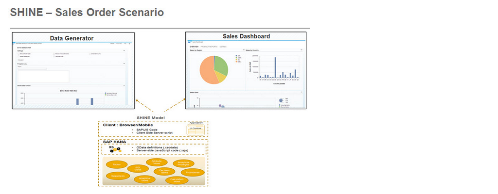
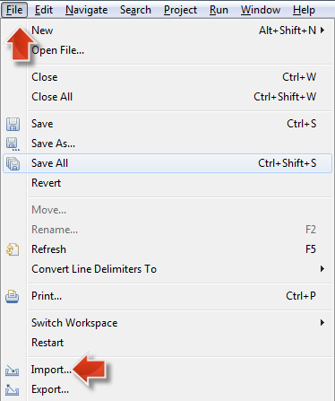
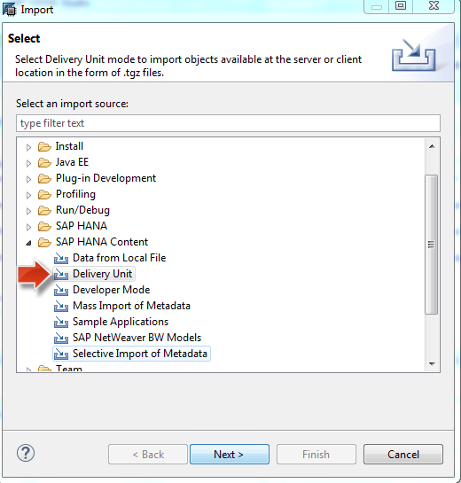
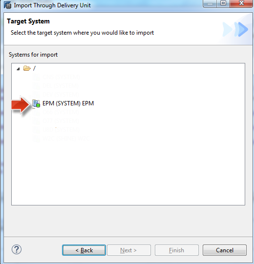
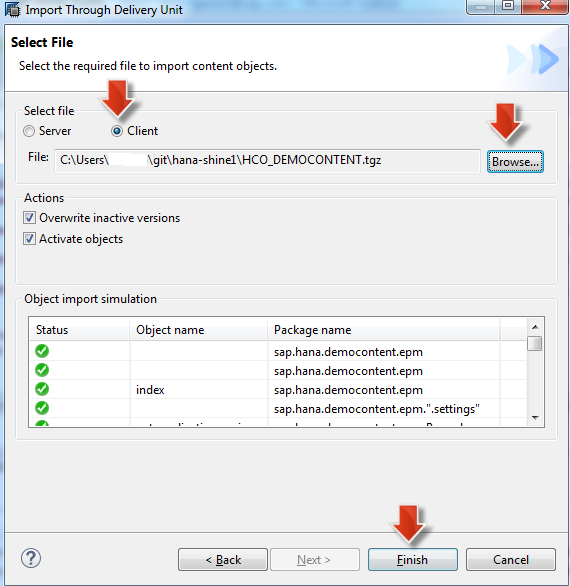
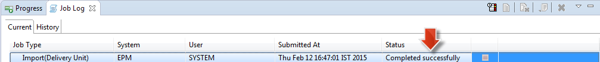
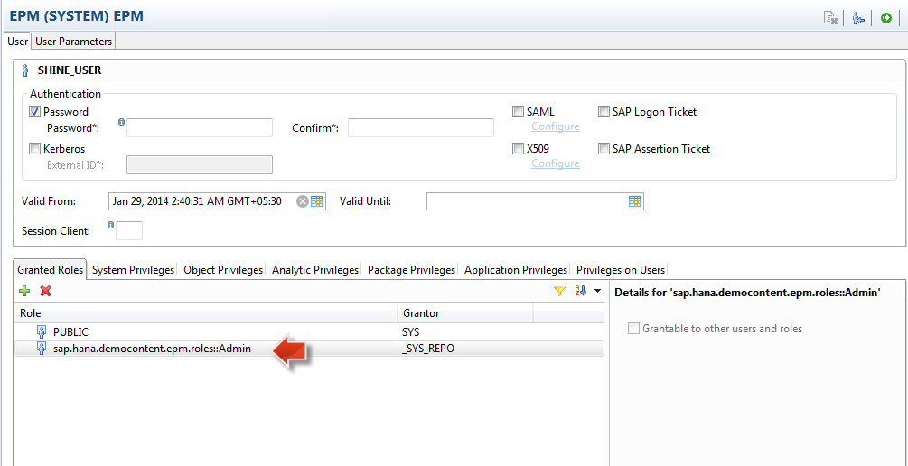
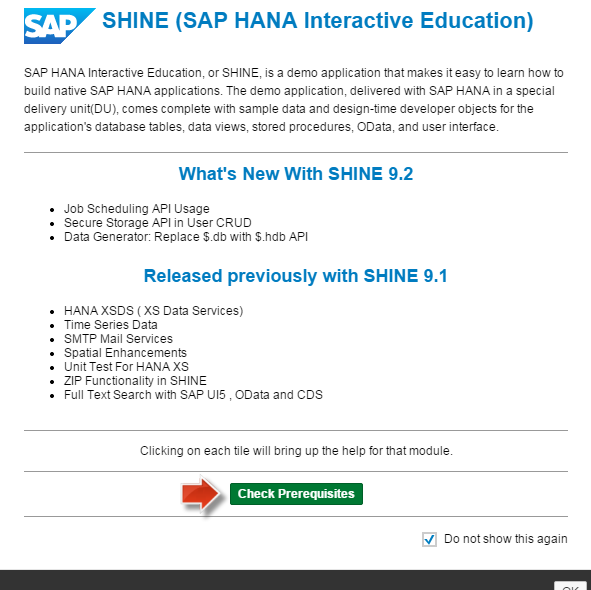
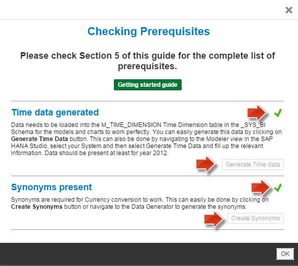

This project is licensed under the Apache Software License, v. 2 except as noted otherwise in the LICENSE file.

## SHINE(SAP HANA Interactive Education)

In this blog I will share details on one of our highly successful and widely consumed Native HANA Application, SHINE (SAP HANA Interactive Education) demo content.     

I will also share details of how you can import the SHINE delivery unit and view the various applications delivered with the demo content as well as explore the code to understand how you can starting building your own native HANA based applications.   

##### What is SHINE – A Brief Overview and History?   
**SAP HANA INteractive Education (SHINE)** is an education content used to learn, develop and deploy SAP HANA Application Services (XS Engine) based applications within the SAP HANA Platform. The SHINE content is designed and built on EPM (Enterprise Procurement Model) framework and includes all the data models, tables, views, dashboards etc. with a real enterprise use case.

##### SHINE – Goal & Objectives:

- Enable a baseline model which can be used in SAP HANA educational materials where customers, partners and developers can use the content for self-study to learn the basic skills to develop and run their applications on top of SAP HANA Platform
- Offer a source of best practice implementation examples, improving the quality of education content with real world business use case scenarios.
- Add new scenarios, features & capabilities to enhance the content
   
##### Getting started with SHINE:
1.	Download The SAP HANA Interactive Education (SHINE) delivery unit (DU)  from [HCO_DEMOCONTENT.tgz](./HCO_DEMOCONTENT.tgz "SHINE DU")

2.	Click on `File->Import->` `SAP HANA Content -> Delivery Unit`Select your System and click on client and select the DU where you downloaded and import the DU.

Select `SAP HANA Content -> Delivery Unit`

Select your System `SID`

Select `Client` and click on browse select the File which you downloaded in step 1 and click on Finish

   

Wait for Import status to be Completed Successfully 

3.	Once Import is successful , assign role `sap.hana.democontent.epm.roles::Admin` to your user.

4.	You can launch the application  by launching `http://<your Host>.<your port>/sap/hana/democontent/epm/`
	
5.	Click on Check Prerequisite 

See if generate time data and create Synonyms is Green else click Generate Time Data and Create Synonyms Button.

You can explore Various scenarios and HANA features.   
You can find list of tutorials **[here](/Tutorials/README.md)** 

The following are some of the features and scenarios  delivered with the SHINE demo content:     

- [Core Data Services (CDS) / HDBDD with Associations](./Tutorials/SHINE-CoreDataService/README.md  "SHINE-Core Data Service")
- [MODELS](./Tutorials/SHINE-VIEWS/README.md "SHINE-VIEWS")
- [Procedures](./Tutorials/SHINE-Procedures/README.md "SHINE-Procedures")
- [XSOData](./Tutorials/SHINE-OdataServices/README.md  "XSOData") 
- [XSJS Services](./Tutorials/SHINE-XSJS-Services/README.md  "XSJS Services")
- [Scalar User Defined Functions](./Tutorials/SHINE-ScalarUserDefinedFunctions/README.md "SHINE-ScalarUserDefinedFunctions")
- [Table User Defined Functions](./Tutorials/SHINE-TableUserDefinedFunctions/README.md  "SHINE-TableUserDefinedFunctions") 
- [Simple Mail Transfer Protocol (SMTP) Mail Service](./Tutorials/SHINE-SimpleMailTransferProtocolScenario/README.md  "Simple Mail Transfer Protocol SMTP Mail Service")
- [SAP HANA Extended Services (XS) Data Services (XSDS)](./Tutorials/SHINE-XSDataServices/README.md  "SAP HANA Extended Services XS Data Services XSDS")
- [Spatial](./Tutorials/SHINE-SpatialScenario/README.md  "Spatial")
- Full Text Search with SAPUI5, OData, and CDS
- Unit Test on SAP HANA
- Series Data
- ZIP API Function 	
- SAP HANA simple info access (SINA)
- SAP HANA UI Integration Services and Fiori Launch Pad Site
- OData Batch Requests
- Fuzzy Search
- Rules on HANA

### References 
- <a href="http://www.saphana.com/docs/DOC-3773" target="_blank">**Core Data Services**</a>
- Rules on HANA:<a href="http://scn.sap.com/community/developer-center/hana/blog/2013/10/11/big-data-decisionmaking-
made-better-with-business-rules-in-sap-hana
" target="_blank">**SAP HANA Developer Guide, Creating Decision Tables**</a>  
- For more information refer to the SAP HANA Developer Guide:<a href="http://help.sap.com/hana/SAP_HANA_Developer_Guide_en.pdf" target="_blank">**SAP HANA DEVELOPER GUIDE**</a>

## License

Copyright (c) 2017-2020 SAP SE or an SAP affiliate company. All rights reserved.
This project is licensed under the Apache Software License, version 2.0 except as noted otherwise in the [LICENSE](LICENSES/Apache-2.0.txt) file.
