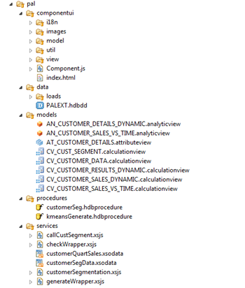
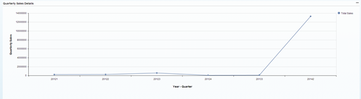
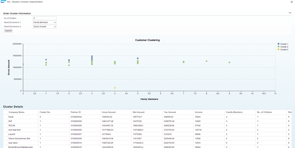

##First Steps into the SAP HANA Predictive Analysis Library (PAL) 

The goal of this blog is to focus on the exciting world of SAP HANA. 
In this blog I would introduce you to the Predictive Analysis Library (PAL) component of SAP HANA and how it is used in context of SHINE demo content.  
We would get started by reviewing what the prerequisites and then installing the Application Function Library component and running the AFL_Wrapper SQL script. Once we have established PAL within our SAP HANA instance, we are all set to go as we analyse the K- Means analytic function from the PAL library that is used in the Customer Segmentation scenario in SHINE

####What is PAL?  
You can refer to SAP HANA Academy **[video](http://www.saphana.com/docs/DOC-3042)** to learn about PAL.  
It provides you with a great starting point, particularly for learning what PAL is and what are the different algorithms associated with PAL.

####Getting Started with PAL on SHINE

In this post  I am going to focus on how to use the K-Means clustering algorithm included in PAL because it is one of the most popular and most commonly used in data-mining. 
But before we jump into the code, let’s understand what is clustering algorithm and a brief overview of the Customer Segmentation scenario in SHINE.
 
The most common use case for a clustering algorithm is customer segmentation, meaning you use a clustering algorithm to divide your customer database in multiple groups (or clusters) based on how similar they are or how similar they behave, e.g.,  age, gender, interests, spending habits and so on.

####How to get started with PAL?

To use PAL functions, you must ensure that the following pre-requisites are met:  

- Install the Application Function Library (AFL), which includes the PAL
		
		Note: The revision of the AFL must match the revision of SAP HANA. Each release of the AFL has a version in the form of <revision_number>.<patch_level>. For example, AFL 40.01 refers to revision 40 and patch level 01, and it should be installed with SAP HANA revision 40 only.
 
- Checking PAL Installation  
To confirm that the PAL functions were installed successfully, you can check the following    

		SELECT * FROM "SYS"."AFL_AREAS" WHERE AREA_NAME = 'AFLPAL';  
		SELECT * FROM "SYS"."AFL_PACKAGES" WHERE AREA_NAME = 'AFLPAL';  
		SELECT * FROM "SYS"."AFL_FUNCTIONS" WHERE AREA_NAME = 'AFLPAL';

Once AFL is successfully installed in your system, you can build your own PAL Scenario in 4 simple steps:   
 
1.	Prepare the Data  
2.	Generate the PAL procedure  
3.	Call the PAL procedure to populate the Assign and Centres table  
4.	Create the HANA Models and the xsodata service for consumption in UI

####PAL in SHINE

Let us now see the two use cases in SHINE that demonstrate the PAL K-Means algorithm:
  
#####Scenario 1: PAL Customer Segmentation (Income VS Total Sales)
In this scenario, the manager wants to segment the customers into different clusters based on their income and total sales and then wants to do a deeper analysis of the customers’ sales trend across different quarters by selecting a particular customer to view its quarterly sales.   
#####Scenario 2: PAL Customer Segmentation (Dynamic attributes)
In this scenario, the manager wants to segment the customers into different clusters based on the attributes provided by the user. The number of clusters to be generated can also be provided by the user.
The AFL wrapper procedure is called based on the dynamically provided user attributes. 

To help you understand these scenarios, you can download and import the SHINE & SHINE with PAL Delivery Unit (DU) from here.

1.Download The SAP HANA Interactive Education (SHINE) delivery unit (DU)  from [HCO_DEMOCONTENT.tgz](../../HCO_DEMOCONTENT.tgz "SHINE DU")   
2.Follow Steps in [Shine Read Me](../../README.md)    
3.Assign the below AFL roles to the user importing HCO_DEMOCONTENT_PAL(SHINE PAL DU) 

	AFL__SYS_AFL_AFLPAL_EXECUTE
	AFLPM_CREATOR_ERASER_EXECUTE

4.Enable script server   
To enable script server run the below SQL statement 

	ALTER SYSTEM ALTER CONFIGURATION ('daemon.ini', 'host', '<hostname>') SET ('scriptserver','instances') = '1' WITH RECONFIGURE

To find host name run sql query 

	SELECT * from SYS.M_LANDSCAPE_HOST_CONFIGURATION

5.Now you can Import SHINE PAL DU by following the same steps as above . You can Find the DU here [HCO DEMOCONTENT PAL](./HCO_DEMOCONTENT_PAL.tgz "SHINE PAL DU")  

6.Add PAL Role to any user who would like to go though/execute the SHINE PAL Scenario 

`sap.hana.democontent.epm.pal.roles::PAL` 

  

You can find the PAL related artifacts in the package “pal” as shown in the below screen shot:

  

####Deep Dive into the Scenarios:

Here we try to understand the scenarios in a detailed manner by exploring the PAL artifacts and the underlying code.

#####Scenario 1: PAL Customer Segmentation (Income VS Total Sales)
You can run the scenario by launching the below URL:

`<host>:<port>/sap/hana/democontent/epm/pal/componentui/index.html`

You can see the following charts in the UI:

  
  

- The 1st chart shows the clusters to which the customers have been assigned to, based on the K-Means clustering Algorithm. 
- The 2nd chart shows all the Customers in a selected Cluster.
- The 3rd chart displays the quarterly sales of the selected customer. 

#####Technical Insights:

######Prepare the Data
The first step is creating the tables that will contain information on customers .

**generateWrapper.xsjs :**
This xsjs file is used to call the procedure  

	"SAP_HANA_DEMO"."sap.hana.democontent.epm.pal.procedures::customerSeg" .

The customerSeg.hdbprocedure creates the K-means Procedure `PAL_CUSTSEGMENT_KMEANS` to be used the Customer Segmentation scenario using the below syntax: 				

	CALL "SYSTEM".afl_wrapper_generator('PAL_CUSTSEGMENT_KMEANS', 'AFLPAL', 'KMEANS', :var_chk);

######Call the PAL procedure

**callCustSegment.xsjs:** This xsjs file calls the procedure `PAL_CUSTSEGMENT_KMEANS` and fills the Center and Assign tables using the below syntax:   
 
	CALL _SYS_AFL.PAL_CUSTSEGMENT_KMEANS("SAP_HANA_DEMO"."sap.hana.democontent.epm.pal.data::PALEXT.PAL_KMEANS_DATA_TBL",#PAL_CONTROL_TBL,?,?) WITH OVERVIEW`

######Create the HANA Models and the xsodata service for consumption in UI  

**customerSegData.xsodata** – This OData service uses the calculation view `CV_CUST_SEGMENT` which maps all the customer details with their corresponding cluster id’s
  
**customerQuartSales.xsodata** – This OData service uses the calculation view `CV_CUSTOMER_SALES_VS_TIME` for retrieving the quarterly sales of the customers 

These services are bound to the SAPUI5 application.  

####Scenario 2: PAL Customer Segmentation (Dynamic attributes)  
 
You can run the scenario by launching the below URL: 

`<host>:<port>/sap/hana/democontent/epm/pal/dyncompui/index.html`

You can see the UI as shown below and you can then pass the following values in the input fields and see the clustering results in the UI:   

- No. of Cluster – An Integer value specifying the number of clusters the customers must be segmented into.
- Dimension 1 (integer) – The first attribute that must be used for the clustering.
- Dimension 2 (double)  - The second attribute that must be used for the clustering.

 

####Technical Insights:

######Generate the PAL procedure
**generateWrapperDyn.xsjs :**  

This xsjs file is used to call the procedure    
		
	"SAP_HANA_DEMO"."sap.hana.democontent.epm.pal.procedures:: kmeansGenerate".
 
The  kmeansGenerate.hdbprocedure creates the K-means Procedure `PAL_CUSTSEGMENT_KMEANS_DYNAMIC`  using the below syntax:

	CALL "SYSTEM".afl_wrapper_generator('PAL_CUSTSEGMENT_KMEANS_DYNAMIC', 'AFLPAL', 'KMEANS', :var_chk);

######Call the PAL procedure

**customerSegmentation.xsjs:**  
This xsjs file calls the procedure `PAL_CUSTSEGMENT_KMEANS_DYNAMIC` and fills the Center and Assign tables using the below syntax:   

	CALL _SYS_AFL.PAL_CUSTSEGMENT_KMEANS_DYNAMIC ("SAP_HANA_DEMO"."sap.hana.democontent.epm.pal.data::PALEXT.PAL_KMEANS_DATA_TBL_DYN",#PAL_CONTROL_TBL_DYN,?,?) WITH OVERVIEW

#####Create the HANA Models and the xsodata service for consumption in UI

**customerSegDyn.xsodata** – This OData service uses the calculation view `CV_CUSTOMER_RESULTS_DYNAMIC`to map the customer details with their corresponding cluster id’s.These services are bound to the SAPUI5 application.

####References 

- **[PAL Developer Guide](http://help.sap.com/hana/SAP_HANA_Predictive_Analysis_Library_PAL_en.pdf)**

