##SMART DATA ACCESS IN SHINE

### 1. Overview
#####1.1 What is Smart Data Access?
Smart Data Access is a data virtualization feature in SAP HANA. This feature was introduced with SP6 in SAP HANA and allows customers to access data virtually from remote sources (heterogeneous sources) such as Hadoop, Oracle, Teradata, SQL Server and SAP databases and combines it with data that resides in an SAP HANA database.

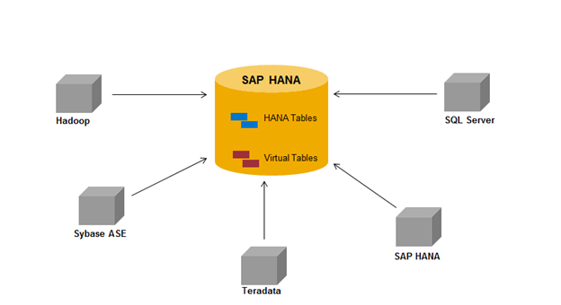 

#####1.2.	How does the Smart Data Access function?
1.	Smart Data Access allows remote access to data stored in other data sources such as Hadoop, Sybase ASE, Teradata, another SAP HANA system etc. without having to move or replicate the data into the SAP HANA system 
2.	Data required from the other remote sources will be available in the virtual tables. The virtual tables points to the remote tables in the other data sources. 
3.	The customers then can send SQL queries in SAP HANA which will operate on the virtual tables. The HANA query processor optimizes these queries, and executes the relevant part of the query in the target database, returns the results of the query to HANA, and completes the operation.

###2.	Smart Data Access Scenario 

#####2.1.	Business Scenario – Product Reviews
As a retailer of an online store, I want to capture the reviews for the products that are sold online and would like to do the analysis on the reviews provided by the customers.
Further Analysis can be done to identify products which are:    
•	Top rated  
•	Lowest rated  
•	Comparisons between sales and rating  
•	Etc.  

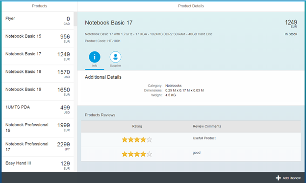 

#####2.2.	Technical Scenario

The product reviews data contain both high and low value data. Since we do not want to over utilize the resources of the SAP HANA system, hence all customer reviews data will be stored stored inside a remote data source (such as Hadoop)     

•	Primary Data Source: SAP HANA (will contain the product details)   
•	Remote Data Source: Hadoop (will contain the reviews data)

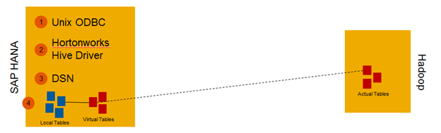 

###3.	Pre-requisites and Configurations

#####3.1.	Pre-requisites

The pre-requisites for the smart data access scenario to work are as follows:

**1.	Unix ODBC driver**
Install the Unix ODBC driver in your HANA system. The Unix ODBC driver is needed so that the SAP HANA system can talk to the Hadoop server in order to read the data from the Hadoop system into the HANA system. 

For more details on how to do you can follow this video  [SDA: Configuring ODBC drivers](http://www.youtube.com/watch?v=yQd_w37NzkE&list=FLJWKDqwNXpiokJyw6LhJCLw "SDA: Configuring ODBC drivers")

**2.	Hive ODBC driver**

Install the Hive driver on the machine with the HANA instance. 
Note: You can install the Hortonworks Hive driver. If the installation runs successful, you should be able to see it in /usr/lib/hive/lib/native/Linux-amd64-64/libhortonworkshiveodbc64.so 

For more details you can follow [Step 6.3 Install Hortonworks Hive ODBC Driver on SAP	HANA AWS Instance](http://hortonworks.com/wp-content/uploads/2013/09/Demo-Tutorial-Leveraging_SAP_HANA__HDP_Jan_2014.pdf) in htis pdf.

#####3.2.	Configurations

**3.2.1.	Configuring the DSN:**   

1.	Logon to the HANA machine using your HANA admin/super user.

2.	Copy the /usr/lib/hive/lib/native/hiveodbc/Setup/hortonworks.hiveodbc.ini to your home directory as .hortonworks.hiveodbc.ini

3.	Edit the .hortonworks.hiveodbc.ini file as follows:   

		a.	If there is a line with DriverManagerEncoding=UTF-32, change it to UTF-16    
		b.	Make sure the ErrorMessagePath=/usr/lib/hive/lib/native/hiveodbc/ErrorMessages     
		c.	Comment out the line: “ODBCInstLib=libiodbcint.so”    
		d.	Uncomment out the line: “ODBCInstLib=libodbcinst.so   
4.	Add Hive DSN entry to .odbc.ini file in your home directory    

		a.	Open or create your .odbc.ini file in your home directory   
		b.	Add the following entry in the file:     
	
		[hive1] 
		Driver=/usr/lib/hive/lib/native/Linux-amd64-64/libhortonworkshiveodbc64.so    
		Host= **** (This is the machine running HIVE i.e. the Hadoop system IP address)    
		Port= **** (This is the port Hive is using (default 10000))   
		HiveServerType=2    
		HS2AuthMech=2    
		UserName=*****    
		Password=*****   

5.	Set environment variables – these exports can be added to $HOME/.customer.sh to avoid having to set them every time. 
   
		a.	Add /usr/lib/hive/lib/native/Linux-amd64-64/ to your LD_LIBRARY_PATH 
		$> export LD_LIBRARY_PATH=$LD_LIBRARY_PATH:/usr/lib/hive/lib/native/Linux-amd64-64/    
		b.	Set ODBCINI to you .odbc.ini file $> export ODBCINI=$HOME/.odbc.ini  
		c. Set UnixOdbc Path as well $>export LD_LIBRARY_PATH=$LD_LIBRARY_PATH:/<your Unix Folder>/unixODBC-2.3.0
		d.Add These 2 as well
		export LD_LIBRARY_PATH=$LD_LIBRARY_PATH:/usr/local/lib/
		export LD_LIBRARY_PATH=$LD_LIBRARY_PATH:/usr/lib64/

6.	Verify that you can connect to Hive through the ODBC Driver    
a.	Connect to hive using isql    
		$>isql –v hive1 
  
Note: You should now be able to query hive now. If this does not connect, try logout and login again.

You can follow the video [SDA: Configuring ODBC drivers](http://www.youtube.com/watch?v=yQd_w37NzkE&list=FLJWKDqwNXpiokJyw6LhJCLw "SDA: Configuring ODBC drivers") which has the steps.

#####3.2.3.	Create table and load data into the table (in the Hadoop system) 

**1. Download the executable Jar File**   
Click on this link to download the JAR file [utils.uploader-0.0.1-SNAPSHOT-jar-with-dependencies.jar](./utils.uploader-0.0.1-SNAPSHOT-jar-with-dependencies.jar "JAR")

and download sample csv file which has sample Data for the table.
[Product_Reviews.csv](./Product_Reviews.csv "CSV")

**2. Execute the  File**   
1. Double click on the File    
2. Enter your Hadoop details and Browse and give your CSV which was downloaded

 
3. Press Submit

If everything is fine then you would get 

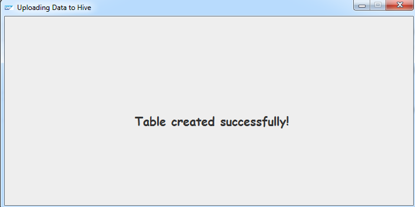 

#####3.2.3.	Import SHINE DU

1.Download The SAP HANA Interactive Education (SHINE) delivery unit (DU)  from [HCO_DEMOCONTENT.tgz](../../HCO_DEMOCONTENT.tgz "SHINE DU")
2.Follow Steps in [Shine Read Me](../../README.md)

#####3.2.4.	Create Remote Data Source

1.	Logon to the HANA system through the HANA studio
2.	Open the SQL console for the system.
3.	To create the remote data source run the below SQL command:    
CREATE remote source HIVE1   
ADAPTER "hiveodbc"  
CONFIGURATION 'DSN=hive1'  
WITH CREDENTIAL TYPE 'PASSWORD'  
USING 'user=hive;password=hive';  

		Note: HIVE1 – is the name of the remote data source to be created in the HANA system. 
        hive1 – is the name of the DSN entry that you created in the .odbc.ini file above
        user/password – should be the user/password to connect to the Hadoop system

4.	Now expand the **Provisioning** folder to see the newly created Remote Source.  Expand the Remote Sources node tree structure: **\HIVE1\HIVE\default\** and check your HIVE table **product_reviews** 

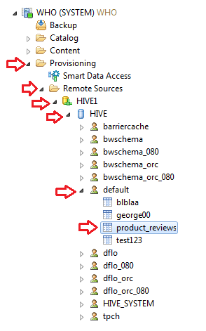 

5.Right click on the Hive Table: **product_reviews** and select: **Add as  Virtual Table**

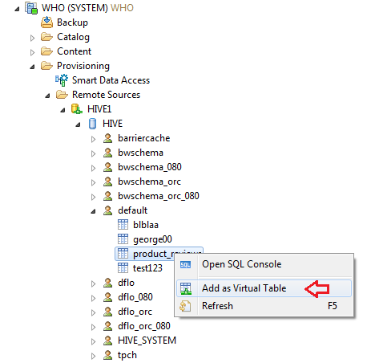 

6.In the Create Virtual Table Pop up window, the Table Name will be displayed as `HIVE1_product_reviews`. Select the Schema as the `SAP_HANA_DEMO`.

	Note: If you have imported the SHINE Delivery Unit, then you will be able to see the SAP_HANA_DEMO schema in the drop down.

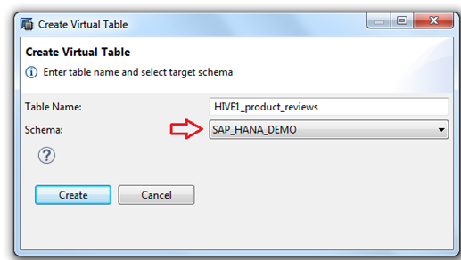 

7.Click on the Create button   
8.You will get a confirmation on the action done above. Click on the Ok button

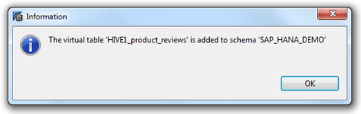

9.Now you can check the newly created Virtual table under `Catalog > Schema SAP_HANA_DEMO > Tables > HIVE1_product_reviews`

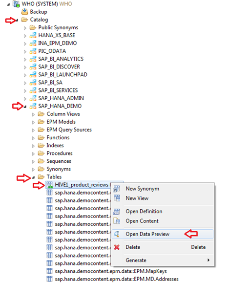

10.You can view the data in the virtual table as follows:

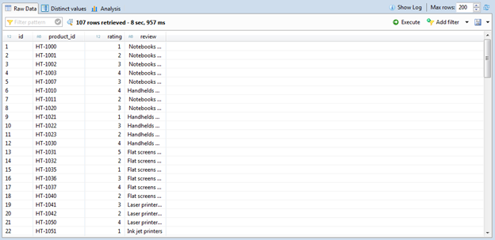

###3.3.	Import and activate the SDA(Smart Data Access) DU

You can download & Import the SDA DU  to your HANA System from the location below:  [HCO DEMOCONTENT SDA](./HCO_DEMOCONTENT_SDA.tgz "SHINE SDA DU")

The sequence of activation of the artifacts should be as follows:   
1.	data folder  
2.	procedures folder  
3.	models folder  
4.	services folder  
5.	ui folder 
6.	roles Folder 

###3.4 Assign Permission to your User
`sap.hana.democontent.epm.sda.roles::sda` to your user.

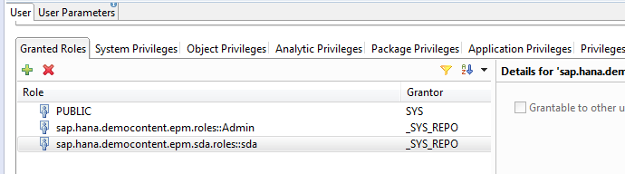

###3.5.	Run the Application

You can access the application 

`https://<host_name>:<port>/sap/hana/democontent/epm/sda/`

Here in this scenario, the data which is pertaining to the product comes from the HANA tables and the details on the reviews of the various products come from the virtual table. 
The user here can now check the details of the various products and provide the review for the product by clicking on the “Add Review” button. This new review provided gets saved in a HANA table. Since Hadoop system only allow mass inserts of data, hence periodically, the data pertaining to the new reviews) provided (from the HANA system) can be pushed to the Hadoop system (using a batch file for mass inserts).
Note: Pushing of the new reviews data from the HANA table to the Hadoop table is currently out of scope for this scenario.

###References 

1. [Smart Data Access- A new feature by HANA](http://scn.sap.com/community/hana-in-memory/blog/2013/08/22/smart-data-access-a-new-feature-by-hana)
2. [SAP HANA Academy - SDA: Connecting multiple SAP HANA servers](https://www.youtube.com/watch?v=CbUEhlMUKE4&list=PLkzo92owKnVx_X9Qp-jonm3FCmo41Fkzm)
3. [SAP HANA Academy - SDA: Creating Calculation View on remote data sources](https://www.youtube.com/watch?v=UX5uDkwnQPw&list=PLkzo92owKnVx_X9Qp-jonm3FCmo41Fkzm&index=6)

