##CORE DATA SERVICES: CREATING DATABASE OBJECTS VIA THE REPOSITORY

In the past, database objects could only be created via SQL directly in the database catalog. However this meant they could not be transported via delivery units like all other repository objects. As part of HANA Native Development, we now have tools to create database objects via a repository representation which generates the catalog objects upon activation.

In this tutorial you will get an insight into the following topics using the SHINE Model as reference:

*	Creating a Schema via HDBSCHEMA file to hold all of our database objects
*	Creating a CDS object i.e. HDBDD file. Use CDS Syntax to define reusable types, structures, tables, associations
*	Setup Automatic Table Data Loads via HDBTI file


In <a href="http://help.sap.com/hana/SAP_HANA_Interactive_Education_SHINE_en.pdf" target="_blank">**SHINE**</a> you can explore the package hierarchy sap->hana->democontent->epm->data to get more details w.r.t CDS as well as Table import configuration for automatic table loads.


###What is is Core Data Services: Creating the Persistence Model in Core Data Service
A first step toward this ultimate vision for CDS is the introduction of the hdbdd development object in SPS6. 
This new development object utilizes the Data Definition Language of CDS to define tables and structures. It can therefore be considered an alternative to .hdbtable and .hdbstructure. You can save the data-persistence object definition as a CDS artifact, that is; a design-time object that you manage in the SAP HANA repository and activate when necessary CDS enables the creation of several tables within a single design time artifact. CDS documents have the file suffix .hdbdd

Core data services (CDS) are a new infrastructure for defining and consuming semantically rich data model in SAP HANA. Using a data definition language (DDL), a query language (QL), and an expression language (EL), CDS is envisioned to encompass write operations, transaction semantics, constraints, and more .

You can use the CDS specification to create a CDS document which defines the following artifacts and elements:

*	Entities (tables)
*	Views
*	User-defined data types (including structured types)
*	Contexts
*	Associations
*	Annotations

###Steps to create CDS Document


**Prerequisites:**  
**1.**  **Creation of Schema** :
You must create a schema for the catalog objects where the CDS entities are stored when the CDS document is activated in the repository.
A database schema is a way to logically group objects such as tables, views, stored procedures etc.

To create a Schema file in the repository, perform the following steps:

Right-click the folder where you want to save the Schema document and choose   ``New``->``Other``->``Database Development`` -->  ``Schema``  in the context  menu

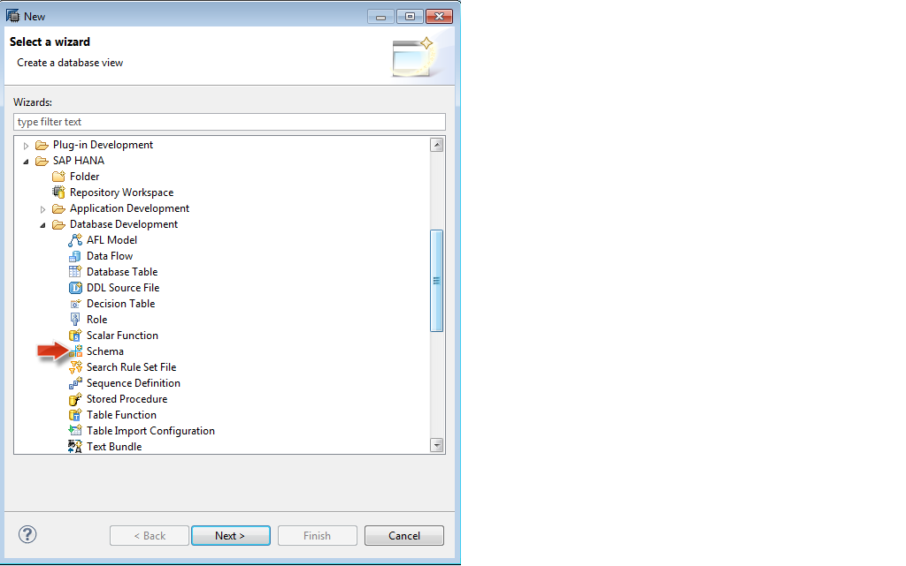

Specify the Schema name in the hdbschema file.

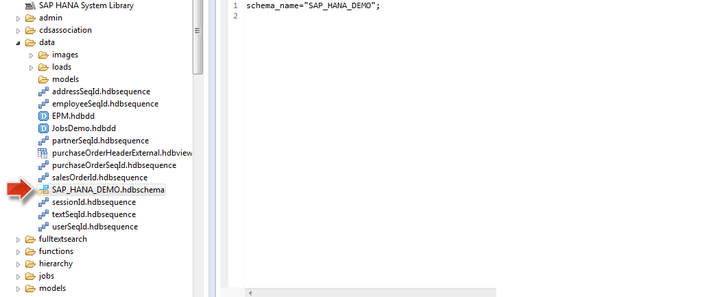

**2.** The owner of the schema must have SELECT privileges in the schema to be able to see the contents of the generated catalog objects.

###To create a CDS document in the repository, perform the following steps:


**1.** Right-click the folder where you want to save the Schema document and choose   ``New``->``Other``->``Database Development`` --> ``DDL Source File``  in the context  menu

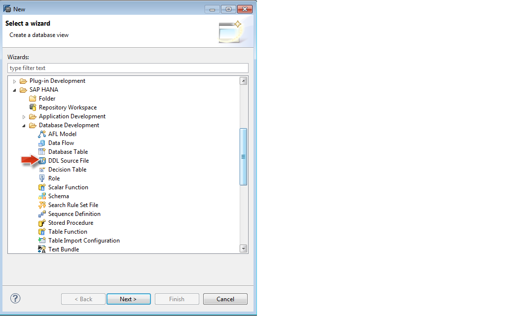

The file-creation wizard creates a basic CDS document with the following elements:


- #####Namespace  
The name of the repository package in which you created the new CDS document, for <a href="http://help.sap.com/hana/SAP_HANA_Interactive_Education_SHINE_en.pdf" target="_blank">**SHINE**</a> the namespace is sap.hana.democontent.epm.data


- #####Top-level element  
The name of the top-level element in a CDS document must match the name of the CDS document itself; this is the name you enter when using the file-creation wizard to create the new CDS document, for <a href="http://help.sap.com/hana/SAP_HANA_Interactive_Education_SHINE_en.pdf" target="_blank">**SHINE**</a> the Context name is EPM as shown below:

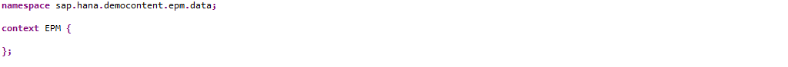

**2.** Define the details of the CDS artifacts. 
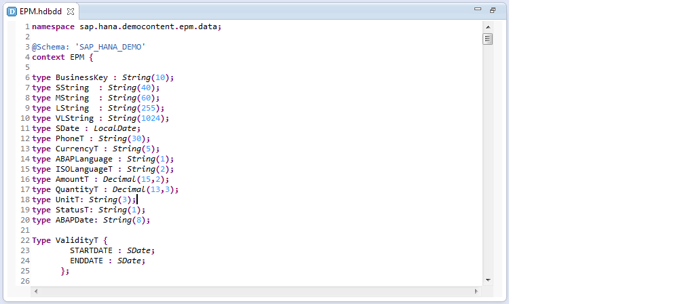

Open the CDS document you created in the previous step, EPM.hdbdd, and add the CDS-definition code to the file. The CDS code describes the CDS artifacts you want to add, for example: entity definitions, type definitions, view definitions and so on:


- 	Add a schema name.  
The @Schema annotation defines the name of the schema to use to store the artifacts that are generated when the CDS document is activated. The schema name must be inserted before the top-level element in the CDS document; in <a href="http://help.sap.com/hana/SAP_HANA_Interactive_Education_SHINE_en.pdf" target="_blank">**SHINE**</a> the Schema used is `SAP_HANA_DEMO`.


- Add structured types, if required.  
Use the type keyword to define a type artifact in a CDS document. In this example, you add the user-defined types and structured types to the top-level entry in the CDS document, the context EPM.


- Add a new sub context, if required.  
Contexts enable you to group together related artifacts. A CDS document can only contain one top-level context, for example, EPM {  };. Any new context must be nested within the top-level entry in the CDS document, as illustrated in the <a href="http://help.sap.com/hana/SAP_HANA_Interactive_Education_SHINE_en.pdf" target="_blank">**SHINE**</a>:

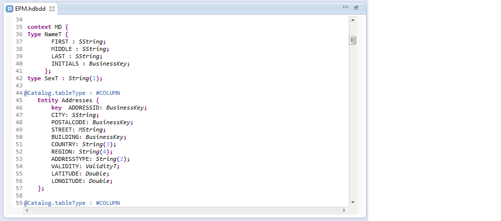


- Add new entities.  
You can add the entities either to the top-level entry in the CDS document; in this example, the context EPM  or to any other context, for example, MD context for Master Data, SO for Sales. In this example, the new entities are column-based tables in the Master Data context.


- Create associations between the entities.  
Here we see an Association between the Business Partner and the Address entities.

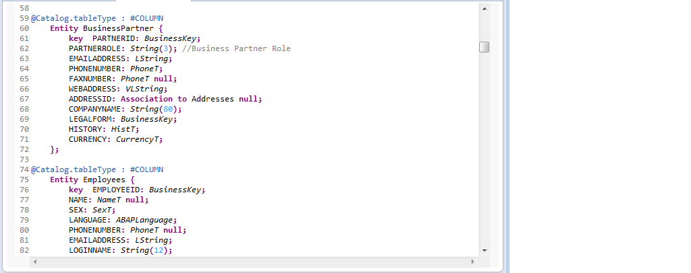

	namespace acme.com.hana.cds.data;

	@Schema: 'SAP_HANA_DEMO’
	context EPM {

	 type BusinessKey : String(10);
	 type SString  : String(40);
	 type <[...]>

	 context MD {
	   @Catalog.tableType : #COLUMN 
	    Entity Addresses {
	        key  AddressId: BusinessKey;
	        City: SString;
	        PostalCode: BusinessKey;
	        <[...]>      
	    };

	  @Catalog.tableType : #COLUMN 
	    Entity BusinessPartner {
	        key  PartnerId: BusinessKey;
	        PartnerRole: String(3); 
	        <[...]>  
	    };
	 };
	 context SO {
	 <[...]>
	 };
	 context PO {
	 <[...]>
	 };
	};


**3.** Save and Activate the CDS document.

**4.**	Ensure access to the schema where the new CDS catalog objects are created.
After activation in the repository, a schema object is only visible in the catalog to the _SYS_REPO user. To enable other users, for example the schema owner, to view the newly created schema and the objects it contains, you must grant the user the required SELECT privilege for the schema object by running the following statement in the SQL Console:


```call _SYS_REPO.GRANT_SCHEMA_PRIVILEGE_ON_ACTIVATED_CONTENT('select','<SCHEMANAME>','<username>');```  

**5.**	Check that a catalog objects has been successfully created for each of the artifacts defined in the CDS document in the appropriate Schema.
When a CDS document is activated, the activation process generates a corresponding catalog object where appropriate for the artifacts defined in the document; the location in the catalog is determined by the type of object generated.

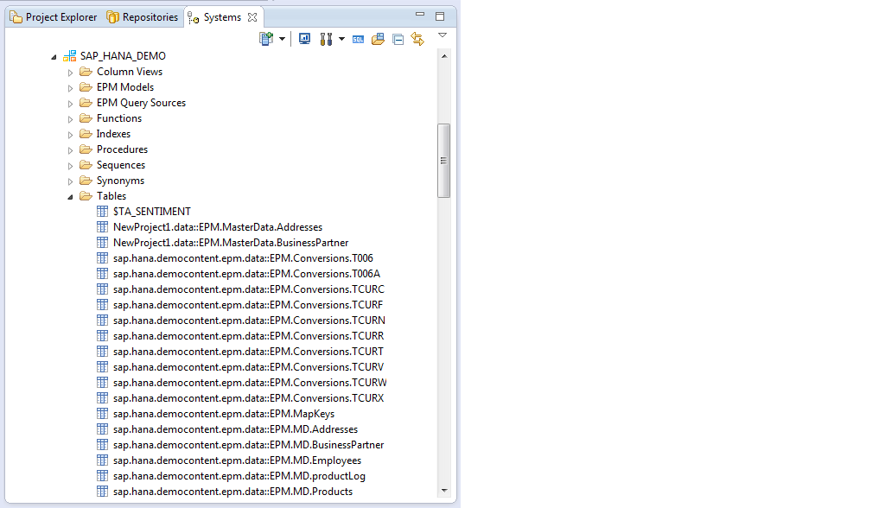


###Setting up Automatic Table Data Loads via HDBTI file    

Once the tables are generated we set up an automatic loading of data into these tables via the table import file   

1. Firstly create the csv files with the data and copy them to the appropriate folder path in your application .The fields in the csv file should be in the same order as the fields in the table for which it is defined.  
2. Next create the table import file.  
Right-click the folder where you want to save the CDS document and choose   New   Other...   Database Development   Table Import Configuration   in the context menu.
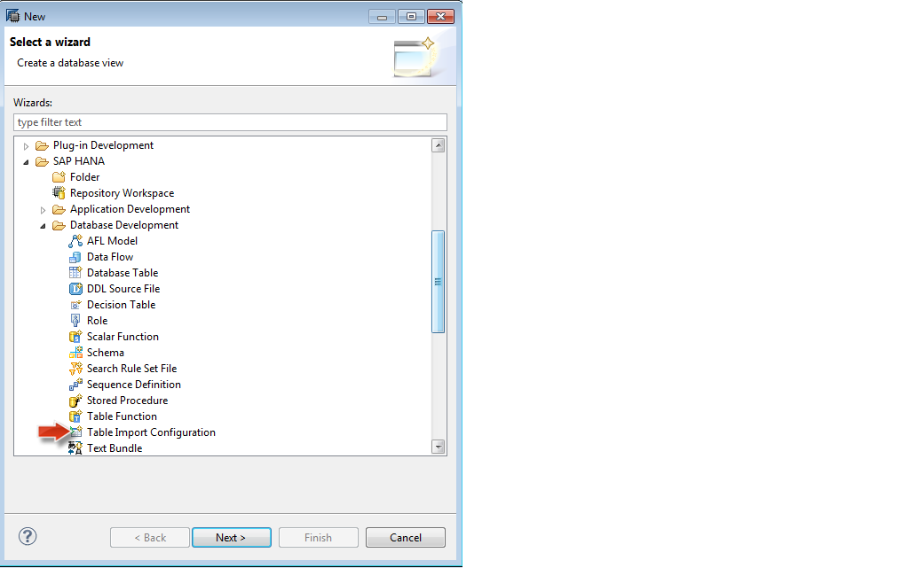
The .hdbti file that maps each .csv file to the correct target table.  
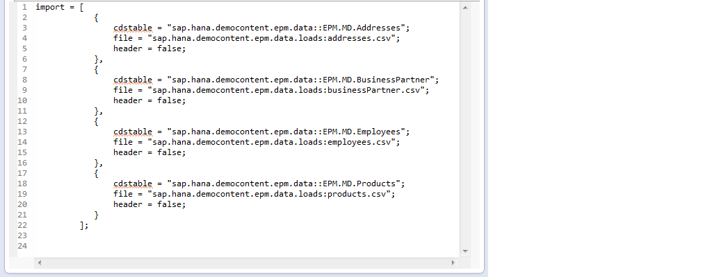

Now you can preview the data in the tables created via CDS:
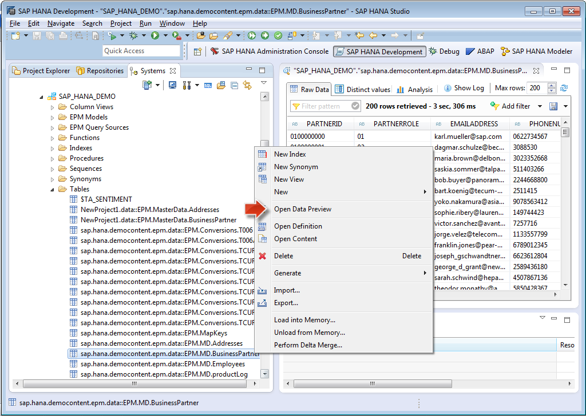

- For the latest documentation on SHINE refer to: <a href="http://help.sap.com/hana/SAP_HANA_Interactive_Education_SHINE_en.pdf" target="_blank">**SHINE GUIDE**</a>  
- For more information refer to the SAP HANA Developer Guide:<a href="http://help.sap.com/hana/SAP_HANA_Developer_Guide_en.pdf" target="_blank">**SAP HANA DEVELOPER GUIDE**</a>

