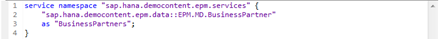
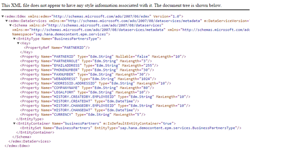
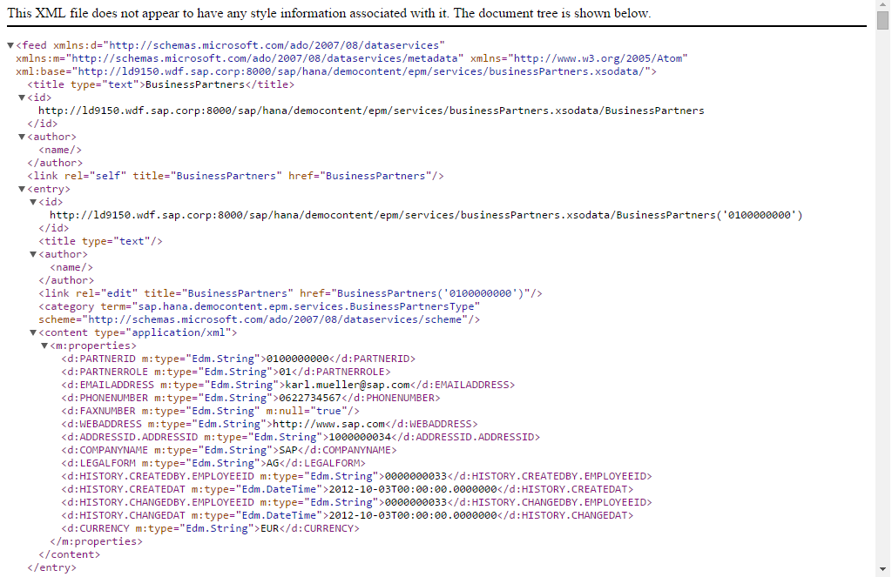
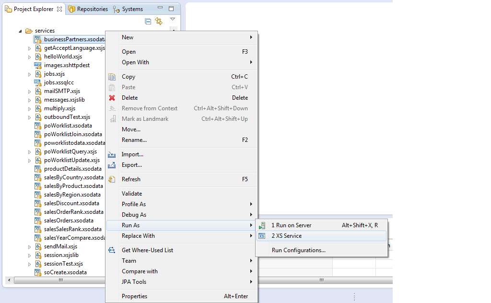
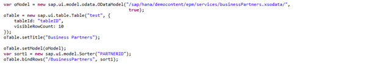
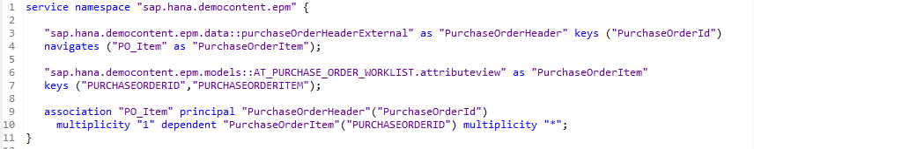
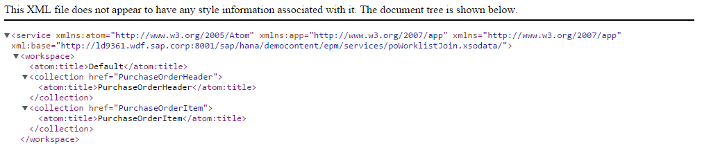
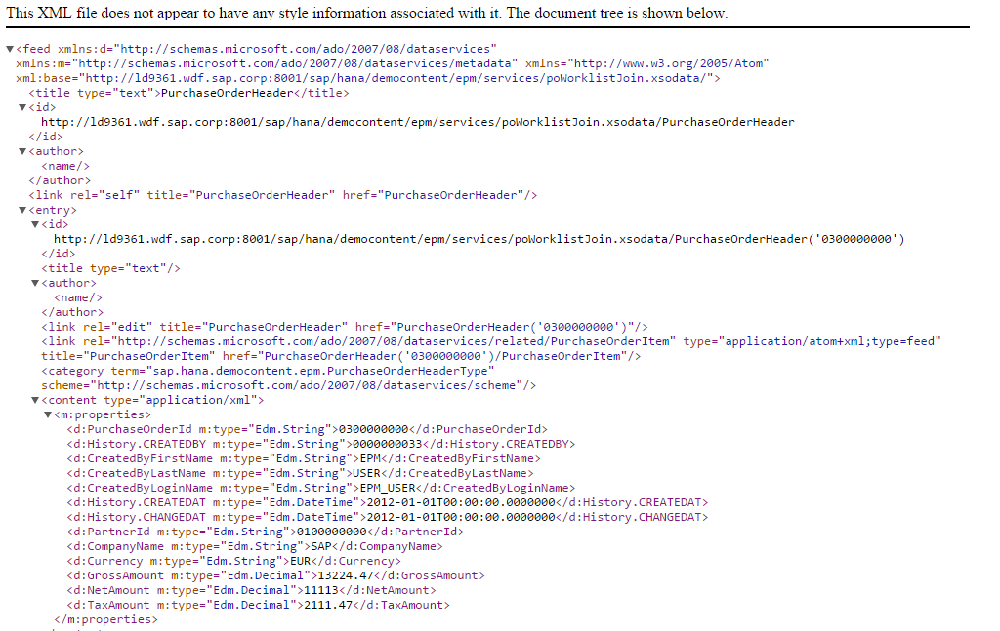
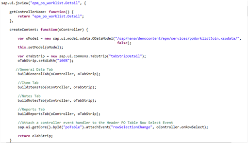
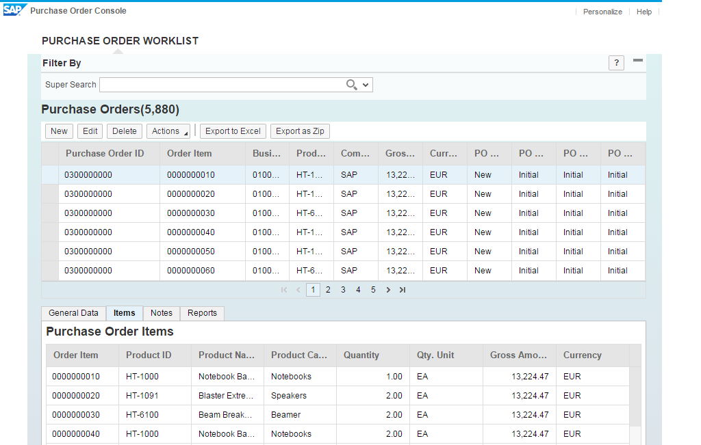

##OData services in SHINE

You want to expose HANA views as OData services. This tutorial shows you how to do so using the development features within the HANA Studio using <a href="http://help.sap.com/hana/SAP_HANA_Interactive_Education_SHINE_en.pdf" target="_blank">**SHINE**</a>  as the reference model.  

Let me first explain you what is an <a href="http://www.odata.org/" target="_blank">**OData**</a>  Service.

	OData (Open Data Protocol) is an OASIS standard that defines the best
	practice for building and consuming Restful APIs. OData helps you  
	focus on your business logic while building RESTful APIs without
	having to worry about the approaches to define request and response
	headers, status codes, HTTP methods, URL conventions, media types,
	payload formats and query options etc. Additionally, OData provides
	facility for extension to fulfil any custom needs of your RESTful
	APIs. OData RESTful APIs are easy to consume. The OData metadata, a
	machine-readable description of the data model of the APIs, enables
	the creation of powerful generic client proxies and tools. Some of
	them can help you interact with OData even without knowing anything
	about the protocol.
 
There are two main parts of the SAP HANA Extended Application Services programming model.

- The first is the ability to generate <a href="http://www.odata.org/" target="_blank">**OData**</a>  services from any existing SAP HANA Table or View
- Next consuming the service from the User Interface.  
 
The process of defining an OData service is simple and easy. From within an SAP HANA Project, create a file with the extension xsodata.  
Within this service definition document, the developer needs only to supply the name of the source table/view, an entity name, and, if using an SAP HANA View, the entity key fields .

The below screenshot shows an example of how you can expose the Business Partner table in the <a href="http://help.sap.com/hana/SAP_HANA_Interactive_Education_SHINE_en.pdf" target="_blank">**SHINE**</a> demo content as an OData service .Here “BusinessPartner” refers to the entity set.

#####XSODATA Service Definition and Test 
Upon activation of this XSODATA file, we already have an as built in support for the OData URI Conventions like $filter, $orderby, etc.   
It also supports body formats of ATOM XML and JSON.

The definition of the OData service can be viewed by using the convention $metadata with the OData service as shown below  
**`http://<myServer>:<XSPort>/sap/hana/democontent/epm/services/businessPartners.xsodata/$metadata`**
Make sure to replace <my Server> and <XS Port> with the host name and port for your SAP HANA XS installation.

The data in the OData service can be viewed by expanding the Entity set:
**`http://<myServer>:<XSPort>/sap/hana/democontent/epm/services/BusinessPartners.xsodata/BusinessPartners`**

The service can be easily tested from the studio as well as the web browser:

This doesn’t represent how end users would interact with the services. Although you can use a variety of 3rd party tools based upon JavaScript, like Sencha, jQuery, PhoneGap,etc., SAP delivers the <a href="http://scn.sap.com/community/developer-center/front-end" target="_blank">**UI Development Toolkit for HTML5 (SAPUI5)**</a> standard in SAP HANA Extended Application Services.   
A particularly strong feature of SAPUI5 is the integration of OData service consumption not just at a library level but also with special features within the UI elements for binding to OData services.

For example, within SAPUI5, you can declare an OData model object and connect this model object to the URL of the XSODATA service. Next, create a Table UI element and connect it to this model object. Finally you call **bindRows** of the Table UI element object and supply the OData entity name you want to use as the source of the table.

This creates an UI Element which has built-in events, such as sort, filter, and paging, which automatically call the corresponding OData Service to fulfill the event. No additional client side or server side programming is necessary to handle such events.

The next example in the <a href="http://help.sap.com/hana/SAP_HANA_Interactive_Education_SHINE_en.pdf" target="_blank">**SHINE**</a> demo content shows how we can add associations to an OData service.  

Here we link the Purchase Order Header table with the Items table linked via the PurchaseOrderId as the key and the cardinality as 1: n

Upon calling the OData service from the web browser, we now see the PurchaseOrderHeader as well as the PurchaseOrderItem entities:

When we expand the PurchaseOrderHeader entity, we see a new entry for the association link to the corresponding Items node: 

  

We can now bind the OData service to the UI via the OData Model Object

  

The below screenshot shows the association between the Purchase Order Header and the Item table. When you select a particular Purchase Order, in the Items tab you can see the details of the Items associated with the Purchase Order.

  

You can explore more on the OData services by navigating to the below specified package path in the <a href="http://help.sap.com/hana/SAP_HANA_Interactive_Education_SHINE_en.pdf" target="_blank">**SHINE**</a> delivery unit:  **/sap/hana/democontent/epm/services**  

- For the latest documentation on SHINE refer to: <a href="http://help.sap.com/hana/SAP_HANA_Interactive_Education_SHINE_en.pdf" target="_blank">**SHINE GUIDE**</a>  
- For more information refer to the SAP HANA Developer Guide:<a href="http://help.sap.com/hana/SAP_HANA_Developer_Guide_en.pdf" target="_blank">**SAP HANA DEVELOPER GUIDE**</a>  
- OData is an open standard; you can read more about the URL parameters and other features at:<a href="http://www.odata.org/" target="_blank">**http://www.odata.org/**</a>  
- SAPUI5:<a href="http://scn.sap.com/community/developer-center/front-end" target="_blank">**http://scn.sap.com/community/developer-center/front-end**</a> 

