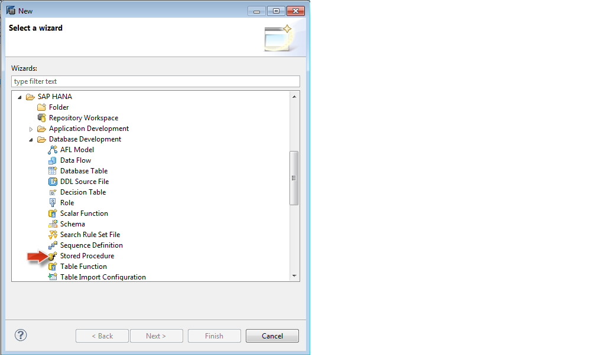
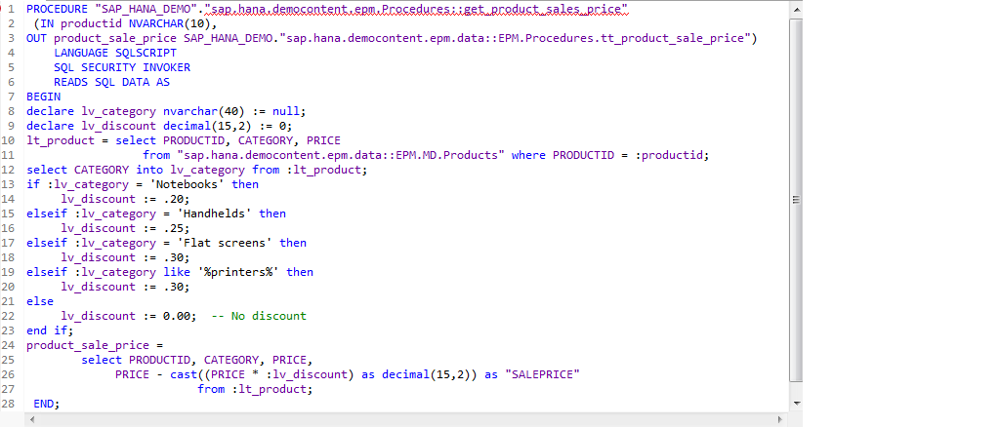
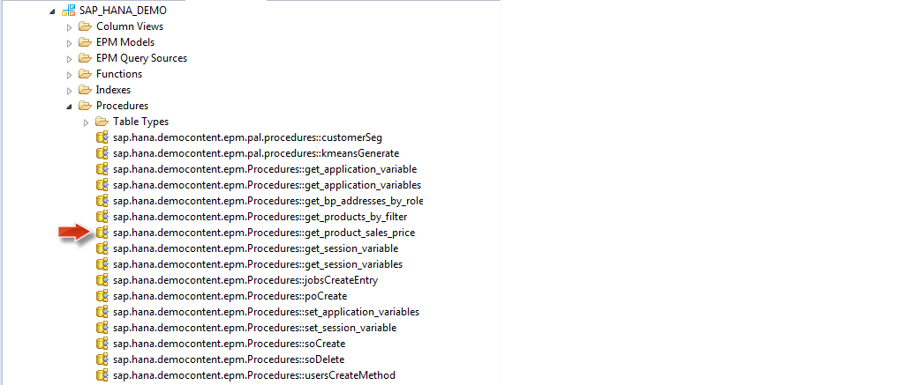
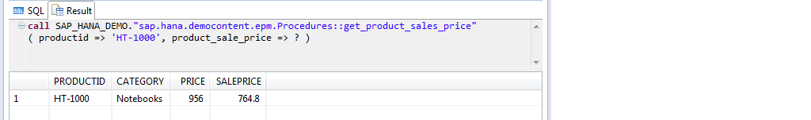
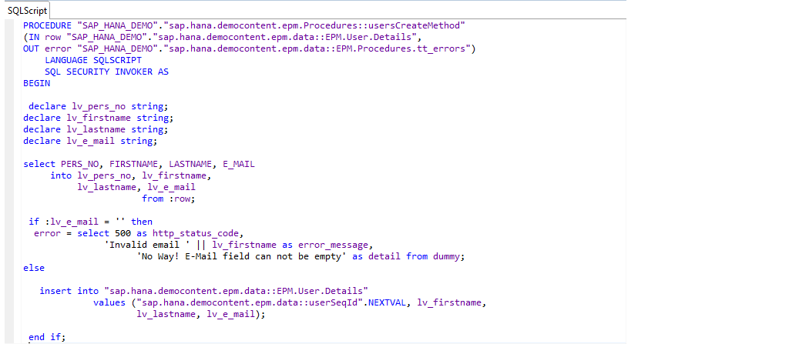
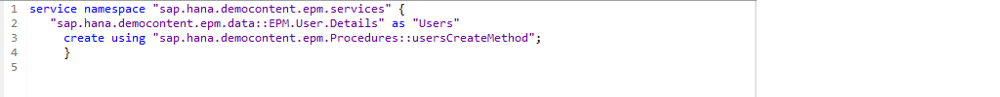
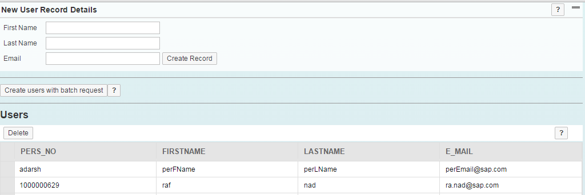

##Stored Procedures in SAP HANA

The goal of these series of tutorials is to explore the new and exciting world of SAP HANA using the <a href="http://help.sap.com/hana/SAP_HANA_Interactive_Education_SHINE_en.pdf" target="_blank">**SHINE**</a> demo model as reference.  

This tutorial shows you how to invoke HANA stored procedures.
We will first see an example of a simple Stored Procedure and then see a more detailed example of how a Stored Procedure can be bound to an application UI. All the code reference can be found in the <a href="http://help.sap.com/hana/SAP_HANA_Interactive_Education_SHINE_en.pdf" target="_blank">**SHINE**</a> Delivery Unit.

#####Why do we need Stored Procedures in HANA?
The SAP HANA SQLScript editor allows you to create, edit, and activate procedures.  

With SAP HANA, logic is often written in stored procedures as they give various advantages over writing plain SQL:

They are pre-compiled which gives a performance gain  

- Complex logic can be encapsulated in an easy to consume form
- They support writing logic in various languages like SQL Script and R Language
- Certain features are only supported in stored procedures (CE functions for example)

#####What is new with SPS7 in HANA Procedures?
In SPS7, we introduce a new file format associated with design-time artifacts for procedures. 
Previously, the .procedure file format was used which was XML based, and was compatible with the procedure editor in the Modeler.   
As of SPS7, we also support the new file format called .hdbprocedure which is DDL based, or plain text based.  This will be the recommended file format to use moving forward.   
You may notice some differences between the two file formats .procedure and .hdbprocedure.  For example, the CREATE keyword has been removed from this syntax.  The procedure definition simply starts with the word PROCEDURE.  You will notice the ability to define the specific schema in which the runtime version is to be created, directly in-line with the name of the procedure.  The entire package hierarchy is also shown here. Finally, you will notice the “Local Table Types” tab is not present. In the .procedure editor, the local table types tab is used to define a table type which can then be referenced by the input/output parameters of the procedure.  Now we recommend creating global table types via CDS (.hdbdd files). 

#####Getting started with SAP HANA Stored Procedures
Start the Create New Procedure wizard in the SAP HANA Studio.
In the Project Explorer view, choose New->Other. In the Select a wizard dialog, choose `SAP HANA->Database Development->Stored Procedure`. 

 

In the SQLScript Editor, define details of the stored procedure.

####Example 1: Simple Example of a Stored Procedure creation in HANA

This procedure is a simple example of a HANA Stored Procedure and it uses standard SQL statements and some imperative logic constructs to determine the sale price of a product based on the product category.  

 

Once you activate the procedure, the new objects will show up in the catalog in the appropriate folder.

 

Test the new stored procedure using SQL console.  
Start the SQL Console and call the new stored procedure.

  

Again, this is a simple example of a Stored Procedure in HANA, but you can see how it could benefit a developer.  These procedures are executed in the database layer of the HANA DB and the hence the processing is very fast.  

In the next example, we will see how a Stored Procedure can be easily consumed by an OData service which in turn can be bound to the UI.

####Example 2: Consumption of Stored Procedure in an OData Service

The userCreate.hdbprocedure contains the logic for a User creation which in turn is called from the user xsodata service as shown below. This data specified in the OData service is then bound to an SAPUI5 Application.  
The userCreate.hdbprocedure takes the user details like first name, last name and email id as input and creates an entry in the User Details table.

The user.xsodata is bound to the userCreate.hdbprocedure.So an HTTP Post request would trigger this OData service which would in turn call the userCreate Procedure.

  

The SAPUI5 view is bound to the OData service user.xsodata

This tutorial gives you an insight of how you can use Stored Procedures in your HANA application as well as how you can call a Stored Procedure from an OData service and bind to a UI.

You can explore the <a href="http://help.sap.com/hana/SAP_HANA_Interactive_Education_SHINE_en.pdf" target="_blank">**SHINE**</a> Delivery Unit to get details regarding the usage of Stored Procedures in an application code.

- For the latest documentation on SHINE refer to: <a href="http://help.sap.com/hana/SAP_HANA_Interactive_Education_SHINE_en.pdf" target="_blank">**SHINE GUIDE**</a> 
- For more information refer to the SAP HANA Developer Guide:<a href="http://help.sap.com/hana/SAP_HANA_Developer_Guide_en.pdf" target="_blank">**SAP HANA DEVELOPER GUIDE**</a>
