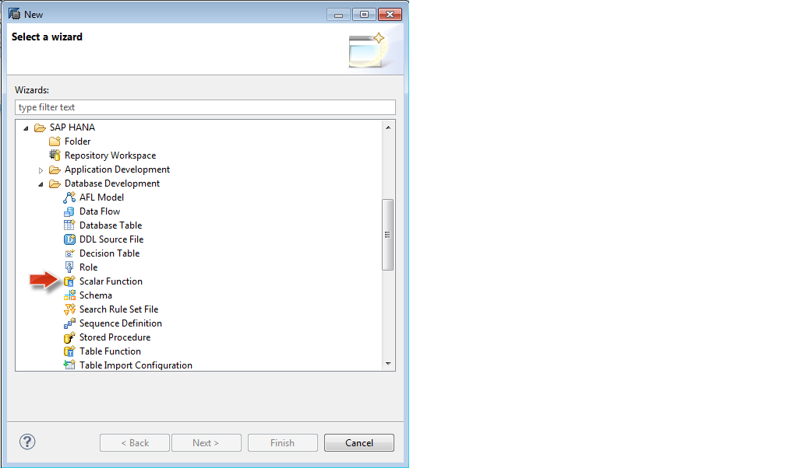
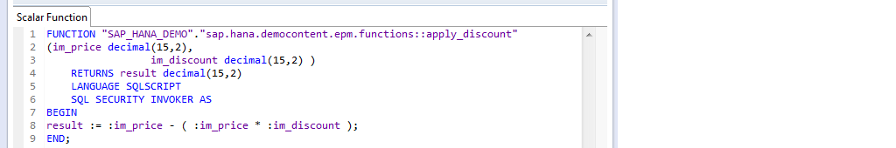
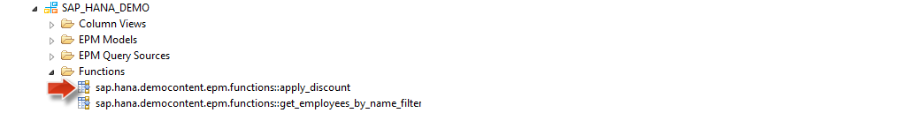
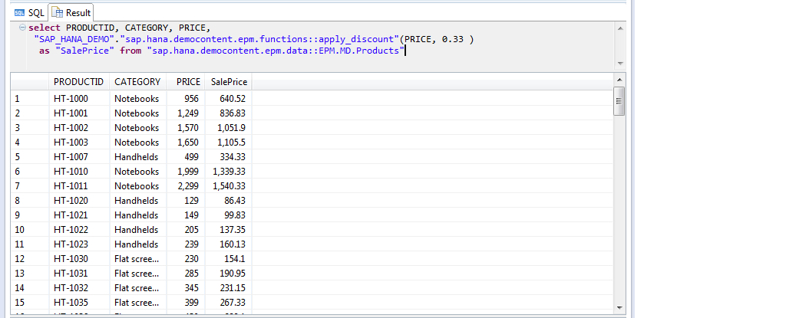

##Scalar User Defined Functions in SAP HANA

The demonstration application SAP HANA Interactive Education (<a href="http://help.sap.com/hana/SAP_HANA_Interactive_Education_SHINE_en.pdf" target="_blank">**SHINE**</a>) includes tutorial to help you learn how to build native SAP HANA applications.

The tutorial provided with the <a href="http://help.sap.com/hana/SAP_HANA_Interactive_Education_SHINE_en.pdf" target="_blank">**SHINE**</a> content show you how to create your own native HANA applications that make use of the sample data and design-time developer objects like: database tables, HANA views, Stored Procedures, Functions, Server-side JavaScript (XSJS), OData services as well as the end user interface using SAPUI5 Technology and Fiori design principles.  

In this blog I would introduce you to **Scalar User Defined Functions** in SAP HANA.

This blog would help you to understand how to create and activate design-time scalar user-defined functions (UDF) and how it is used in the context of <a href="http://help.sap.com/hana/SAP_HANA_Interactive_Education_SHINE_en.pdf" target="_blank">**SHINE**</a> demo content.

Before we move on with creating a Scalar UDF, let us try to first understand what Scalar UDFs in SAP HANA is:

**Scalar UDFs** are user-defined functions which accept multiple input parameters and returns exactly one scalar value.  
These functions allow the developer to encapsulate complex algorithms into manageable, reusable code which can then be nested within the field list of a SELECT statement.

#####How can you get started with creating a Scalar UDF?

Below is an example showing how to create a scalar UDFs and then leveraging it within the field list of a SELECT statement.  
This is a very simple example and focus is purely to help you understand the syntax removing any complex logic.

This function is available with the <a href="http://help.sap.com/hana/SAP_HANA_Interactive_Education_SHINE_en.pdf" target="_blank">**SHINE**</a> Delivery Unit and it gives you an insight of how you can create Scalar User Defined functions and use them in your application code.

You can create the Scalar UDF in the HANA repository via an XS Project.

Start the Create New UDF wizard as shown below:

In the Project Explorer view, choose `New -> Other ->SAP HANA - >Database Development -> Scalar Function`.

 

In the SQL Editor, type the code that defines the new user-defined function.
This example demonstrates a discount function which takes the price and discount unit as the input parameters and returns the new discounted price as the output parameter.
The output is a scalar value and this function can be nested within the field list of a SELECT statement.

Once you activate the function, the new objects will show up on the catalog in the appropriate package.

You can now use the functions in the field list of your SELECT statements. 
You can call the function from the SQL Console as shown:

Again, this is a simple example, but you can see how powerful a tool scalar UDFs could be to a developer.  

- For the latest documentation on SHINE refer to: <a href="http://help.sap.com/hana/SAP_HANA_Interactive_Education_SHINE_en.pdf" target="_blank">**SHINE GUIDE**</a> 
- For more information refer to the SAP HANA Developer Guide:<a href="http://help.sap.com/hana/SAP_HANA_Developer_Guide_en.pdf" target="_blank">**SAP HANA DEVELOPER GUIDE**</a>

 

