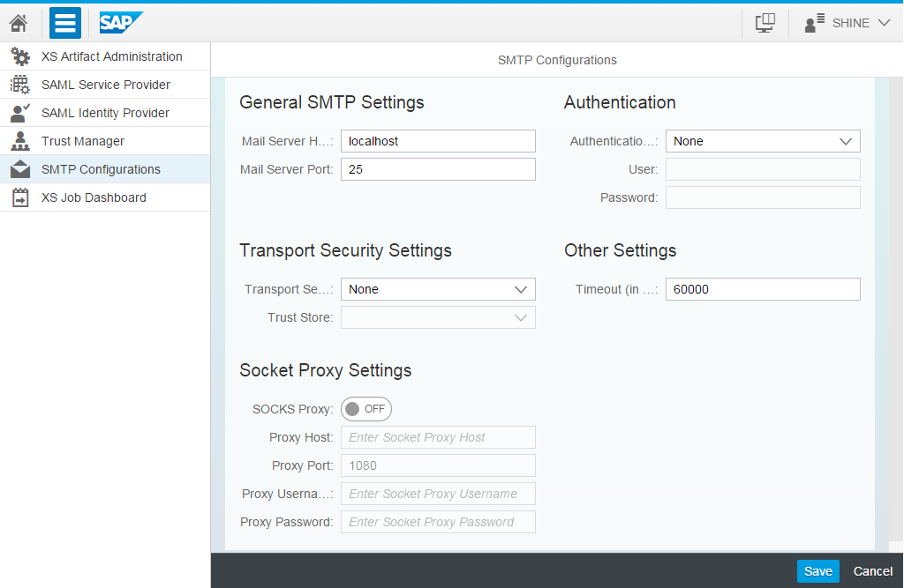
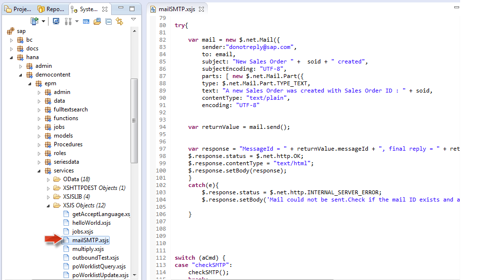
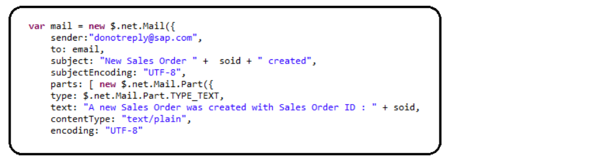
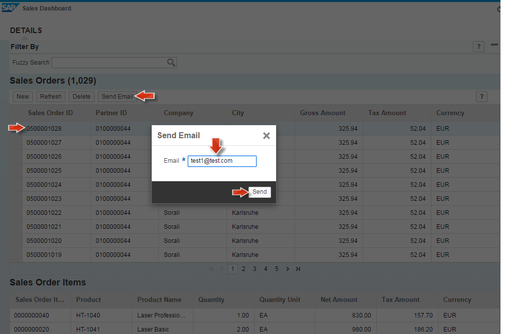

##Simple Mail Transfer Protocol (SMTP) Mail Service with SHINE

In this tutorial, I will introduce you to yet another new feature supported by HANA for e-mail transmission using SMTP.

####Introduction to SMTP

Simple Mail Transfer Protocol (SMTP) is a wide spread Internet Standard for e-mail transmission in use today. Mail servers and other mail transfer agents use SMTP to send and receive mail messages.

With SHINE, we deliver a simple scenario for mail transfer where in you can select a sales order id from the sales worklist and then send the details to a specified email id.

####SMTP Mail Service

The SMTP configuration defines the details of the SMTP server that is available for use by all applications
running on an SAP HANA XS server.    
You can configure one SMTP server per SAP HANA XS server.    
As part of the configuration, you specify the following options:    

- SMTP Host System details
- Logon authentication type
- Transport-channel security type
- Other settings

####Role assignment

To access the SMTP Configuration tools that enables you to set up an SMTP server for SAP HANA XS   
Applications, you must have the following roles assigned:
    
- sap.hana.xs.admin.roles::RuntimeConfAdministrator
- sap.hana.xs.admin.roles::SMTPDestAdministrator

####How to get started?

To set up SMTP in your landscape you need to perform the following configuration as shown in the below screenshot   

1. Start the SAP HANA XS administration tool with the URL:**`http://<WebServerHost>:80<SAPHANAinstance>/sap/hana/xs/admin/`**
2. Start the SMTP Configurations tool. In the list of XS Administrations tools, choose SMTP Configurations. The SMTP screen appears. You can manage the configuration of the SMTP server used by SAP HANA XS applications.
3. Specify details of the system hosting the SMTP server that the SAP HANA XS applications must use.
	1. Provide the name of the system hosting the SMTP server.
	2. Provide the port number required to open a connection.
	3. The default host is local host and the port number is 25.
4. Specify the authentication settings required for access to the SMTP host.
	1. Choose an authentication method from the Authentication Type drop-down list, for example, auto,
Logon, or none.
	2. If necessary, provide the user credentials required to log on to the SMTP server.
3. Specify the security settings for the transport-channel.  
The transport channel is used for the communication between the SAP HANA XS application and the
SMTP server.
	1. If you choose either the STARTTLS or the SSL/TLS option, use the Trust Store drop-down list to
specify the trust store where the certificates and keys for the SMTP sever are located.

6. Define the timeout setting for connections to the specified SMTP server.
You can specify the maximum length of time (in milliseconds) that SAP HANA XS must wait for a
response from the SMTP server with which it is trying to establish a connection; the default value is
60000 milliseconds (1 minute).

7. Define the socket proxy settings.
If your system uses a proxy service for Socket Secure (SOCKS) routing, you need to enable support
using the SOCKS Proxy field (ON) and, in addition, provide connection details for the system where the
proxy service is running. For example, the host name, the port number to use for connections, and the
user credentials required to log on.

8. Save the changes you have made to the SMTP configuration.

Once the SMTP Configuration is established, you can trigger the mail from the application using the
**$.net.Mail() API**. 

In SHINE, explore the mailSMTP.xsjs service under the specified package path to learn: ”**How to trigger the mail from an XS application**”:   
**/sap/hana/democontent/epm/services** 

Here we use the **net.Mail() API**  to trigger mail services passing the sender and recipient details as well as the mail content .

Once SMTP is configured, mail can be triggered from the Sales Dashboard as shown in the SHINE demo content.
	
1. In the Sales Order Dashboard, select a Sales Order and then choose Send Mail.
2. In the Send Email popup, type your mail address and choose Send to receive sales order details in the specified e-mail address.

- For more details on SMTP, refer to the below link: <a href="http://help.sap.com/saphelp_hanaplatform/helpdata/en/e2/7c22ec14e14949b66053a4dcdb7570/content.htm" target="_blank">**http://help.sap.com/saphelp_hanaplatform/helpdata/en/e2/7c22ec14e14949b66053a4dcdb7570/content.htm**</a>  
- For the latest documentation on SHINE refer to: <a href="http://help.sap.com/hana/SAP_HANA_Interactive_Education_SHINE_en.pdf" target="_blank">**SHINE GUIDE**</a>  
- For more information refer to the SAP HANA Developer Guide:<a href="http://help.sap.com/hana/SAP_HANA_Developer_Guide_en.pdf" target="_blank">**SAP HANA DEVELOPER GUIDE**</a>
 
	

