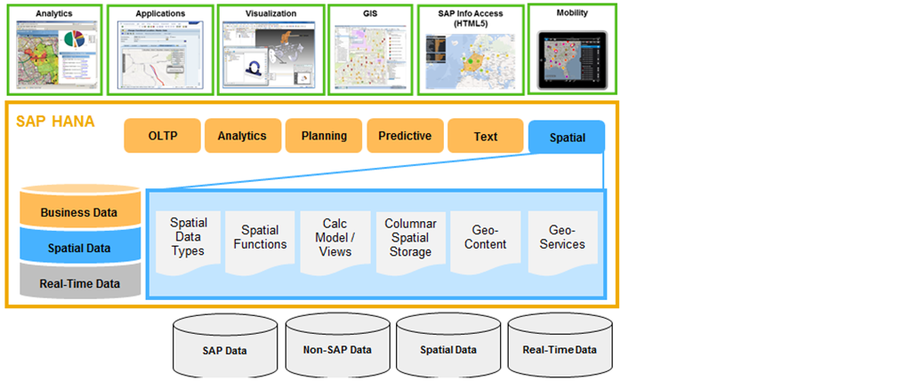
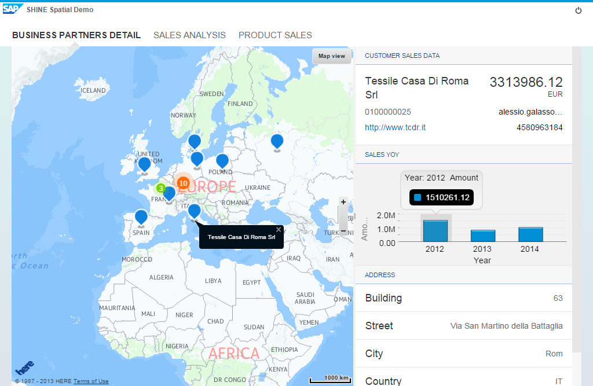
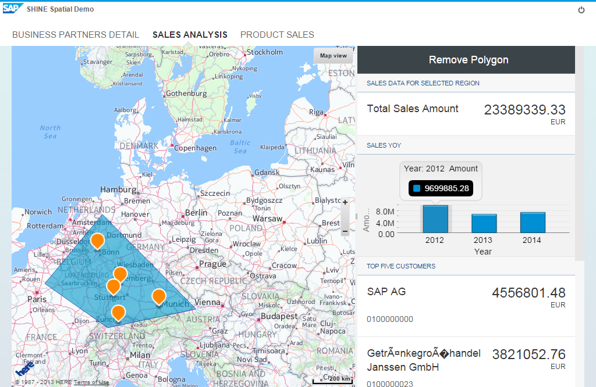
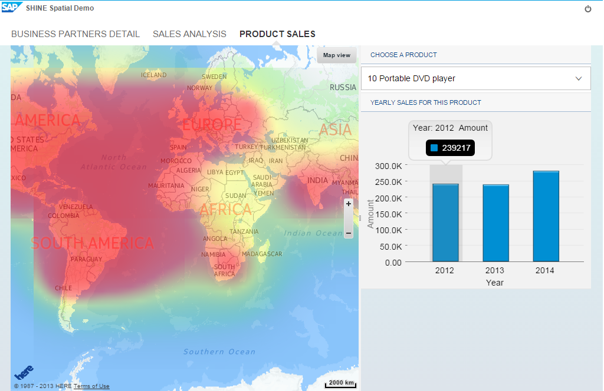
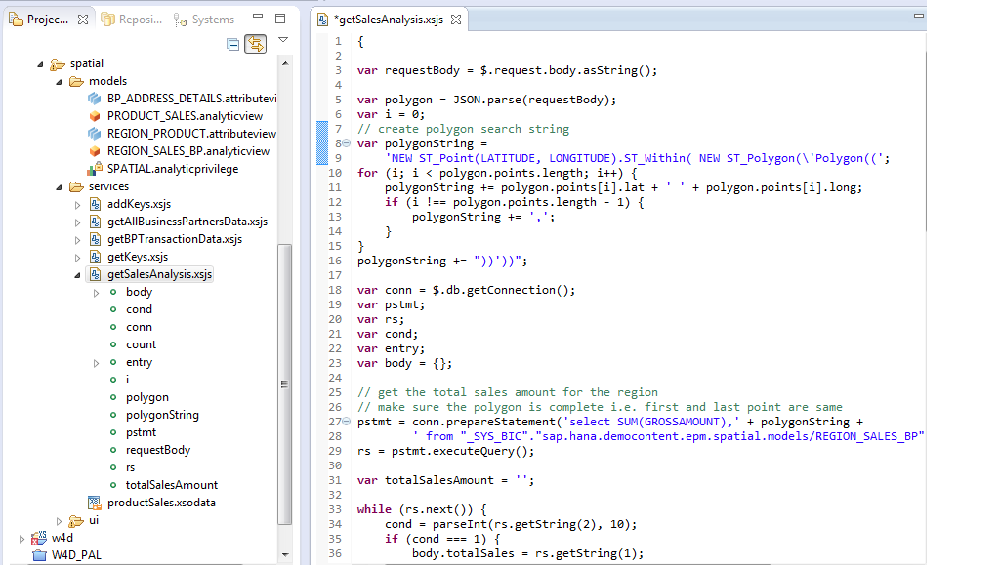

##SPATIAL Feature in SHINE

With one of the recent revision of SAP HANA SP6 we have delivered the HANA Spatial features as part of the HANA platform.  

Let me first explain you what SPATIAL feature in the HANA World means.  

**SPATIAL** enables organizations to store their Geospatial data along with Business data.

By extending the HANA Platform capabilities customers can perform operations on spatial data like calculating the distance between geometries, determining the union or intersection of multiple objects. 

HANA Spatial delivers the ability to store and process geospatial data types like ST_POINT, ST_GEOMETRY etc. These data types allow application developers to associate spatial information with their data. 
For example, a table representing companies could store the location of the company as a point, or store the delivery area for the company as a polygon. This could be represented in SQL as:
SELECT NEW ST_Polygon (‘Polygon ((0 0, 0 1, 1 1, 1 0, 0 0 ))').ST_Contains( NEW ST_POINT('Point(0.5 0.5)') ) FROM dummy;

  

By combining the Spatial engine with other HANA engines like Predictive, Planning, and Text Search etc. customers can apply complex algorithms to the combined data set and derive deep insights.  

 SAP HANA also delivers Nokia mapping services as part of the HANA Spatial features and this can be used to create apps using HANA XS engine through which Nokia mapping services can be called using the Nokia API.   

Once Spatial data is loaded into HANA you can create or extend HANA models like Analytical or Calculation Views and make these models available for analysis and visualization through SAPUI5 based end user interfaces or SAP Lumira or custom HTML5 applications.

With SHINE we deliver the following scenarios for SPATIAL feature in HANA:

#####BUSINESS PARTNERS DETAIL

This tab displays the Business Partners in the specific Region.   
You can select a specific Business Partner and see its Sales Details over a period of time.

  

#####SALES ANALYSIS

This tab displays the Sales for the Business Partners.   
The data on the right side reflects the analysis for the visible region.   
You can also create a polygon by clicking the edges on the map and the data displayed will change to reflect the sales of the selected region.

  

#####PRODUCT SALES

This tab displays the Sales for the selected Product.    

Here we visualize the Product usage based on the density using the heat map overlay.

  

#####Technical Insights:

For code details you can import the SHINE Delivery Unit and analyze the spatial sub package by navigating to the below specified path:

**/sap/hana/democontent/epm/spatial**

  

#####For Business partner details

We have combined BUSINESS PARTNER and ADDRESS table with new Longitude and latitude column to get all locations of the business partners.   

This query is performed and executed in spatial/services/getAllBusinessPartnersData.xsjs which returns a json array of the business partners. All this information is clustered using nokia clustering and displayed on the map.   

Whenever a business partner is selected we do an extra query on that particular BP.    

For this we have use services/getBPTransactionData.xsjs in this xsjs we query sales amount grouped over year, to show the chart in the right side pane.

#####For Sales analysis

In this we use the previously created BP_ADDRESS_DETAILS attribute view and combine it with SO.Header to create an analytic view. From the UI we collect the polygon or the current map boundaries and pass it to spatial/services/getSalesAnalysis.xsjs to perform a query on the analytic view which gives us the top 5 buyers and also the total sales amount for that region, and sales amount grouped by Year to display the chart.

#####For Product sales

In this scenario which is trying to depict product sales on the world map, we first create an attribute view REGION_PRODUCT to combine SO.Header, SO.ITEM, MD.PRODUCTS, MD.ADDRESSES to link sales data with product information. Then we create PRODUCT_SALES analytic view to aggregate this information for products and sales location. On these views we generate an OData service spatial/services/productSales.xsodata to use in the UI5 application.   

When a product is selected we query the service for that particular product to get the location of sales plus the quantity. We pass this information to nokia heatmap provider using quantity as the weight, which renders the heatmap. 

- For the latest documentation on SHINE refer to: <a href="http://help.sap.com/hana/SAP_HANA_Interactive_Education_SHINE_en.pdf" target="_blank">**SHINE GUIDE**</a>  
- SAP HANA Spatial Reference Guide <a href="http://help.sap.com/hana/sap_hana_spatial_reference_en.pdf" target="_blank">**SAP HANA SPATIAL REFERNECE GUIDE**</a> 
- For more information refer to the SAP HANA Developer Guide:<a href="http://help.sap.com/hana/SAP_HANA_Developer_Guide_en.pdf" target="_blank">**SAP HANA DEVELOPER GUIDE**</a>
