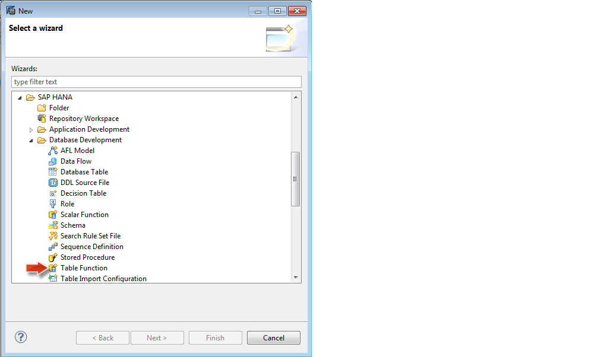
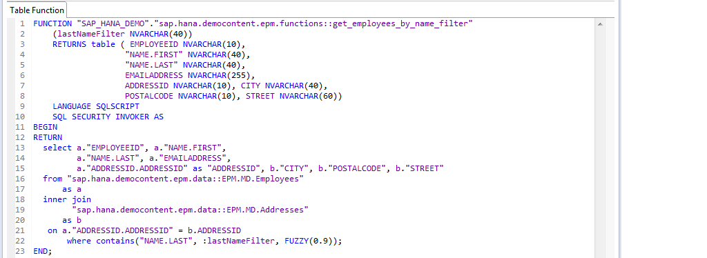
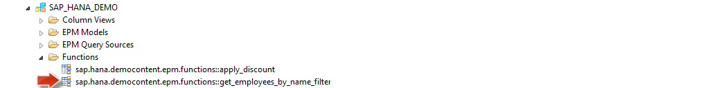
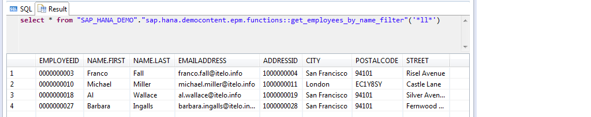

##Table User Defined Functions

The demonstration application SAP HANA Interactive Education (<a href="http://help.sap.com/hana/SAP_HANA_Interactive_Education_SHINE_en.pdf" target="_blank">**SHINE**</a>) includes tutorials to help you learn how to build native SAP HANA applications.  

The tutorials provided with the <a href="http://help.sap.com/hana/SAP_HANA_Interactive_Education_SHINE_en.pdf" target="_blank">**SHINE**</a> content show you how to create your own native HANA applications that make use of the sample data and design-time developer objects like: database tables, HANA views, Stored Procedures, Functions, Server-side JavaScript (XSJS), OData services as well as the end user interface using SAPUI5 Technology and Fiori design principles.  

In this tutorial I would introduce you to Table User Defined Functions in SAP HANA.

This tutorial would help you to understand how to create and activate design-time table user-defined functions (UDF) and how it is used in the context of <a href="http://help.sap.com/hana/SAP_HANA_Interactive_Education_SHINE_en.pdf" target="_blank">**SHINE**</a> demo content.  

Before we move on with creating a Table UDF, let us try to first understand what Table UDFs in SAP HANA is:

Table UDFs are read-only user-defined functions which accept multiple input parameters and return exactly one results table.  SQLScript is the only language which is supported for table UDFs. Since these functions are ready-only, only read-only statements like SELECT can be used within the function.  So you may not use statements like INSERT, UPDATE or DELETE. 
Also, any procedure calls within the function must also be read-only.

####How can you get started with creating a Table UDF?

Below is an example showing how to create table UDFs and then leveraging it within a SELECT statement.  This is a very simple example and focus is purely on the syntax removing any complex logic.
This function is available with the <a href="http://help.sap.com/hana/SAP_HANA_Interactive_Education_SHINE_en.pdf" target="_blank">**SHINE**</a> Delivery Unit and it gives you an insight of how you can create Table User Defined functions and use them in your application code.

You can create the Table UDF in the HANA repository via an XS Project.

Start the Create New UDF wizard as shown below:

In the Project Explorer view, choose `New -> Other ->SAP HANA - >Database Development -> Table Function`.

In the SQL Editor, type the code that defines the new user-defined function.
This example demonstrates a table UDF called `GET_BP_ADDRESSES_BY_ROLE` which accepts an input parameter called “partner role”, and returns a table with the structure defined explicitly to get the employee details.  You can also use global types to define the output structure as well. This function will execute a SELECT statement which contains an INNER JOIN of two tables and returns the result set to the output table parameter.

Once you activate the function, the new objects will show up on the catalog in the appropriate folder.

The function can now be used in the FROM clause of your SELECT statements.  You can pass the input parameters as well. You can call the function from the SQL Console as shown:

Again, this is a simple example, but you can see how a table UDFs could benefit a developer.

- For the latest documentation on SHINE refer to: <a href="http://help.sap.com/hana/SAP_HANA_Interactive_Education_SHINE_en.pdf" target="_blank">**SHINE GUIDE**</a> 
- For more information refer to the SAP HANA Developer Guide:<a href="http://help.sap.com/hana/SAP_HANA_Developer_Guide_en.pdf" target="_blank">**SAP HANA DEVELOPER GUIDE**</a>

