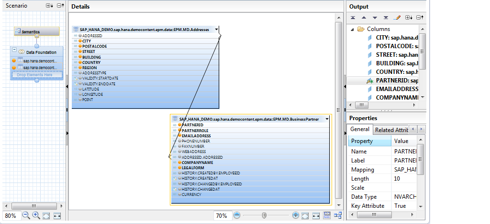
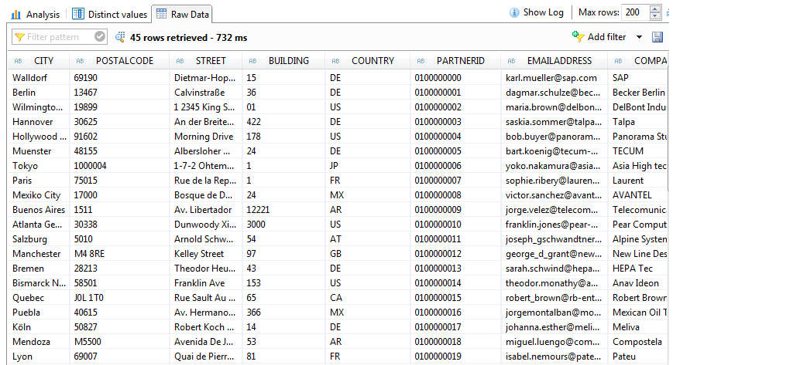
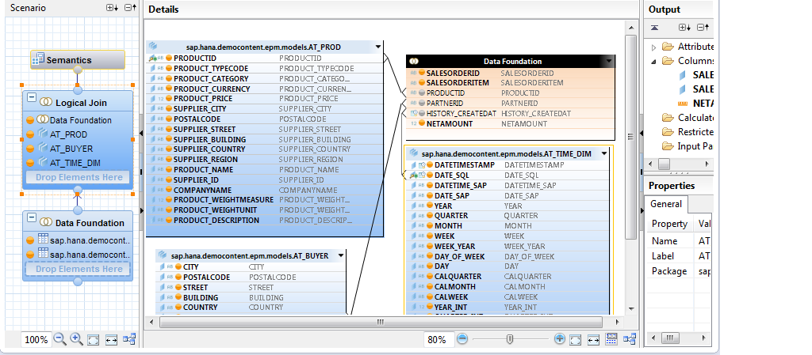
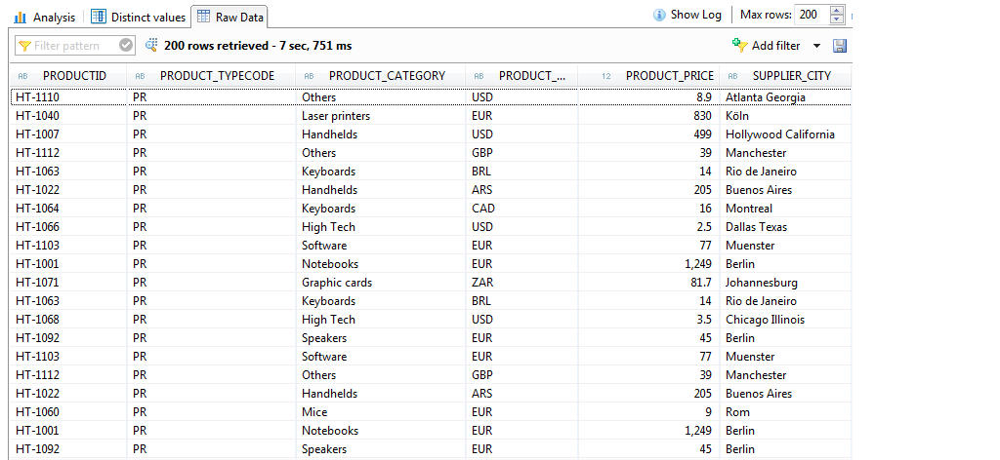
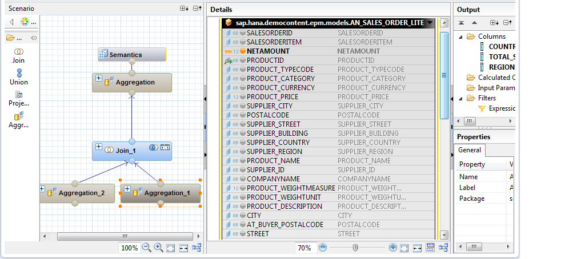
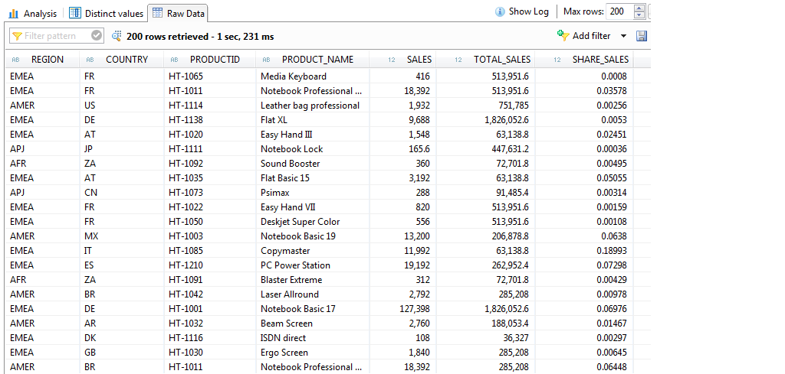
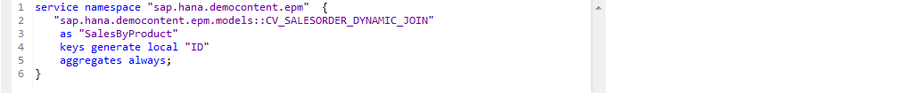
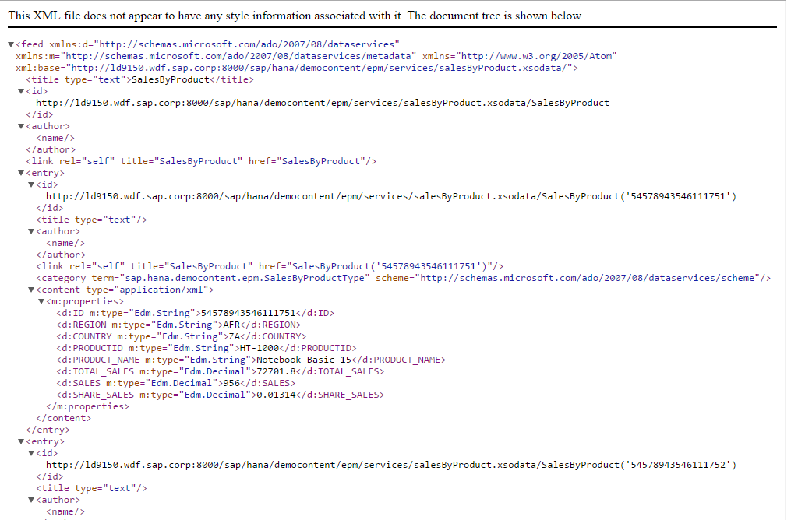
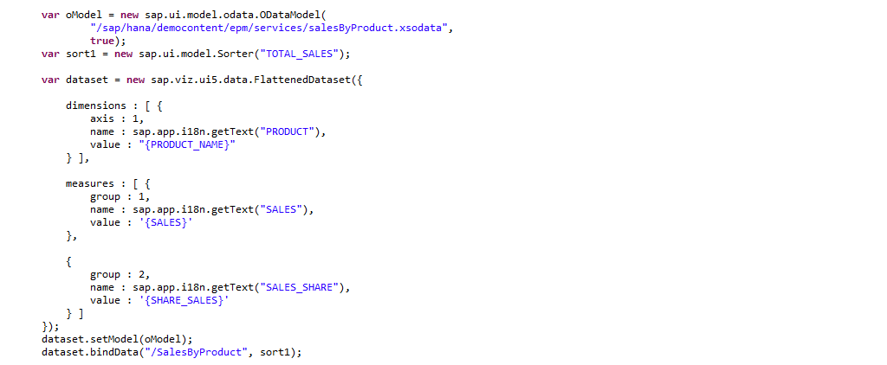
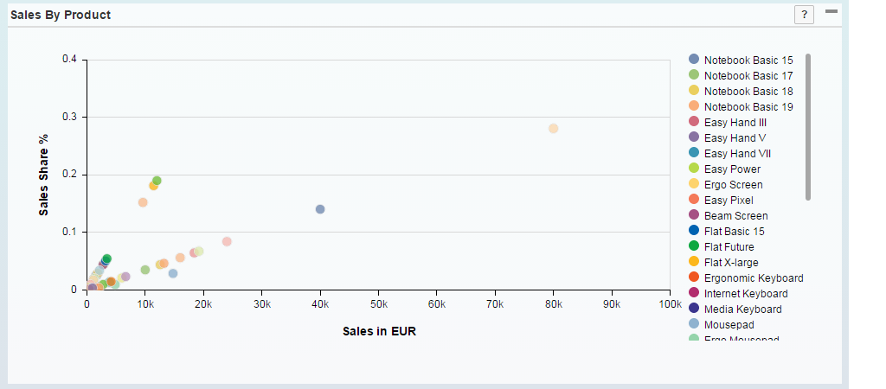

##Views in SHINE  

Modeling refers to an activity of refining or slicing data in database tables by creating views to depict a business scenario. 
The views can be used for reporting and decision making.  
In this tutorial I will be taking you through the modeling process using <a href="http://help.sap.com/hana/SAP_HANA_Interactive_Education_SHINE_en.pdf" target="_blank">**SHINE**</a> Model as the reference which involves the simulation of entities, such as business, product, and sales, and the relationships between them. 

The business use case that I would be describing here is the Sales by Product in the <a href="http://help.sap.com/hana/SAP_HANA_Interactive_Education_SHINE_en.pdf" target="_blank">**SHINE**</a> demo content.
I will showing you in this tutorial how the end to end scenario is modelled using the HANA Views and how the views are consumed in an OData services which in turn is bound to the SAPUI5 Application.   
 
Information views use various combinations of content data (that is, nonmetadata) to model a business use case. 
You can model entities in SAP HANA using the Modeler perspective, which includes graphical data modeling tools that allow you to create and edit data models (content models) and stored procedures. With these tools, you can also create analytic privileges that govern the access to the models, and decision tables to model related business rules in a tabular format for decision automation.
You can create the following types of information views:  

- Attribute Views
- Analytic Views
- Calculation Views

Before we see how the views are modelled, let us try to first understand what is the purpose of each of the different Views in HANA.

#####Attribute Views
You can use attribute views to model an entity that is based on relationships between attribute data contained in multiple source tables.   
For example, customer ID is the attribute data that describes measures (that is, who purchased a product).However, customer ID has much more depth to it when joined with other attribute data that further describes the customer (customer address, customer relationship, customer status, customer hierarchy, and so on).   
You create an attribute view to locate the attribute data, and to define the relationships between the various Tables to model how customer attributes data, for example, will be used to address business needs.
You can model the following elements within an attribute view:

- Columns
- Calculated Columns 

#####Analytic views

Analytic views are used to model data that includes measures.
For example, an operational data mart representing sales order history would include measures for quantity, price, and so on.   

The data foundation of an analytic view can contain multiple tables. However, measures that are selected for inclusion in an analytic view must originate from only one of these tables.
Typically, you can include attribute views in the analytic view definition. In this way, you can achieve additional depth of attribute data. The analytic view inherits the definitions of any attribute views that are included in the definition.      

Analytic views can also be a combination of tables that contain both attribute data and measure data; for example, a report requiring the following:

`<Customer_ID Order_Number Product_ID Quantity_Ordered Quantity_Shipped>`  

You can model the following elements within an analytic view:  
Columns	  
Calculated Columns  
Restricted Columns Variables  
Input parameters  

You can choose to further fine-tune the behavior of the attributes and measures of an analytic view by setting the properties as follows:   

- Apply filters to restrict values that are selected when using the analytic view.   
- Define attributes and measures as Hidden so that they can be used in calculated columns but are not visible to end users. 

#####Calculation view

A calculation view is used to define more advanced slices on the data in the SAP HANA database. Calculation Views can be simple and mirror the functionality found in both attribute views and analytic views. However, they are typically used when the business use case requires advanced logic that is not covered in the previous types of information views.			 

For example, calculation views can have layers of calculation logic, can include measures sourced from multiple source tables, can include advanced SQL logic, and so on. The data foundation of the calculation view can include any combination of tables, column views, attribute views and analytic views. You can create joins, unions, projections, and aggregation levels on the sources.  

You can model the following elements within a calculation view:  
  
- Attributes
- Measures
- Calculated Columns
- Counters
- Hierarchies (created outside of the attribute view)
- Variables
- Input parameters

Calculation views can include measures and be used for multidimensional reporting or can contain no measures and used for list-type of reporting. Calculation views can either be created using a graphical editor or using SQLScript.These various options provide maximum flexibility for the most complex and comprehensive business requirements.    
For the Sales by Product Business scenario in SHINE  we start off by modelling the attribute view:  
This scenario involves creation of three attribute view:   

1.	`AT_BUYER`
2.	`AT_PROD`
3.	`AT_TIME_DIM` - This is a time based attribute view that uses the table `_SYS_BI.M_TIME_DIMENSION` to get the hierarchical time data which can be combined with the Sales data to determine sales of Product based on year, month, etc.

In this tutorial, I will show you the view `AT_BUYER` to help you understand how an attribute view is modelled.
This view uses the BusinessPartner and Addresses table of the <a href="http://help.sap.com/hana/SAP_HANA_Interactive_Education_SHINE_en.pdf" target="_blank">**SHINE**</a> demo schema `SAP_HANA_DEMO`.
The two tables are joined by the `ADDRESSID` field.
The appropriate columns are marked for output and the `PARTNERID` Column is set as a Key Attribute.
The view is then saved and activated.

You can then view the data in the attribute view by doing a data preview on the view.

In the similar way we model the **`AT_PROD`** and **`AT_TIME_DIM`** attribute views.  
Next we model the analytical view `AN_SALES_ORDER_LITE`.  
Here we use the Sales Order Header and Item tables in the Data Foundation .We add measure from these transnational tables as output.
  
In the Logical Join we add the attribute views that we modelled above:  

- `AT_PROD`  
- `AT_BUYER`  
- `AT_TIME_DIM`

These views are linked to the data foundation using the key attributes to get meaningful context information.

The data can be viewed using a Data Preview.

Finally the Analytical View **`AN_SALES_ORDER_LITE`** is consumed in the calculation view **`CV_SALESORDER_DYNAMIC_JOIN`** to get the Sales of the Product per region as well as the Total Sales of the Product for the Country.

The measures are aggregated here and the relevant fields are added as output.

Next we consume this Calculation View in the OData service **“salesByProduct.xsodata”** as shown below: 
 

  

The OData service document can be viewed my providing the service path and navigating to the entity set.

 

Finally the OData service is consumed in the UI via the oModel binding:

 

The **Sales By Product** chart can be viewed from the Sales Dashboard:

 

To view the models in the <a href="http://help.sap.com/hana/SAP_HANA_Interactive_Education_SHINE_en.pdf" target="_blank">**SHINE**</a> Delivery Unit, you can navigate to the below path:  

`/sap/hana/democontent/epm/models`

- For the latest documentation on SHINE refer to: <a href="http://help.sap.com/hana/SAP_HANA_Interactive_Education_SHINE_en.pdf" target="_blank">**SHINE GUIDE**</a>  
- For more information refer to the SAP HANA Developer Guide:<a href="http://help.sap.com/hana/SAP_HANA_Modeling_Guide_en.pdf" target="_blank">**SAP HANA MODELING GUIDE**</a>
- For more information refer to the SAP HANA Developer Guide:<a href="http://help.sap.com/hana/SAP_HANA_Developer_Guide_en.pdf" target="_blank">**SAP HANA DEVELOPER GUIDE**</a>
