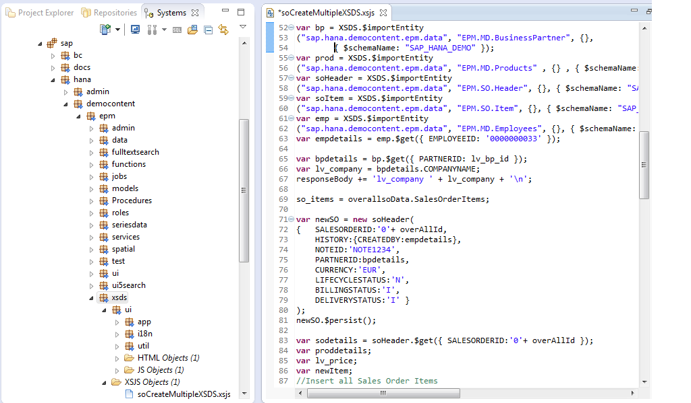
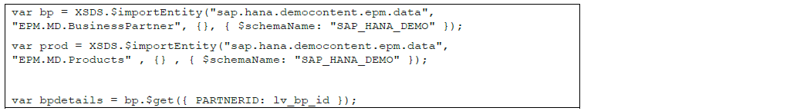
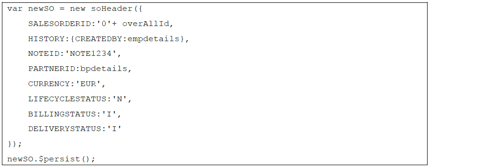
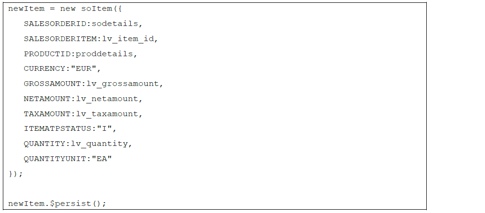
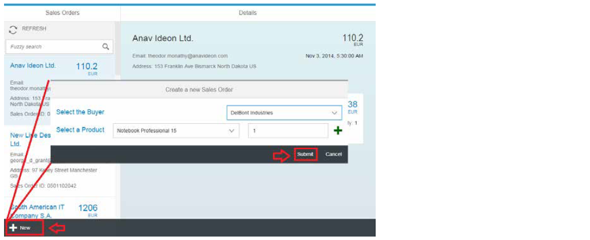
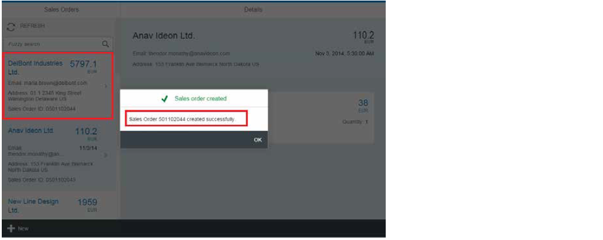

##XSDS or XS Data Services with SHINE

In SPS 09 release of SAP HANA, SAP introduces a major extension to the programming model in the form of a reusable XSJS Library called XSDS or XS Data Services. There are several goals for this new library and the impact that it has on the overall programming model.

#####General HANA artifact consumption  
- Native JavaScript embedding of HANA database artifacts 
- Structured API calls instead of low-level SQL Interface
- Less boilerplate coding (for example result set conversions)

#####Native CDS Consumption

- Import CDS entities as native JavaScript objects
- Understand CDS metadata for working with JavaScript objects

Core Data Services (CDS) are a cross-platform set of concepts and tools to define semantically rich data models for SAP HANA applications.  
At its core, XSDS allows you to import and extend CDS entity definitions.  You simply supply the package path and file name of the HDBDD and the entity name during the import. The XSDS library reads the available metadata on types, keys and associations.  It also supports extensions, projections, and renaming of entity definitions as well as CDS conceptions (like backlink and via entity associations) which aren't yet supported by HDBDD definitions.  

 
In this simple example we import the Employees entity from the EPM hdbdd artifact and the MasterData Context.

	1. 	$.import("sap.hana.xs.libs.dbutils", "xsds");  
	2.	var XSDS = $.sap.hana.xs.libs.dbutils.xsds;  
	3.	var oEmployee = XSDS.$importEntity("sap.hana.democontent.epmNext.data", "EPM.MasterData.Employees");  

oEmployee is a now a JavaScript which contains all this metadata which was already defined in the underlying CDS model. It also supports full CRUD operations  via this JavaScript object.

<a href="http://help.sap.com/hana/SAP_HANA_Interactive_Education_SHINE_en.pdf" target="_blank">**SHINE**</a> provides a new UI to showcase the XSDS API. You can find the artifacts under
**/sap/hana/democontent/epm/xsds** package path in the SHINE delivery unit:

Additionally, you can locate the UI using the XS Data Services tile in the launchpad.

In the script you can query the product details, business partner details based on the Product ID and Partner ID sent from the UI.

You can then create a Sales Order Header, and subsequently link each sales order item to the header as
follows.

Once the sales order is created, its ID is sent back to the UI. The newly created sales order is also reflected in the sales order list.

#####SAP HANA XS Data Services (XSDS) UI details:
Use the following steps to create a new sales order:   
1. In the Sales Orders worklist screen, choose + New.
The Create New Sales Order dialog appears. 
  

2.Select the appropriate information in the fields and choose Submit.
When the sales order is created, the Sales Order ID is visible the UI. The newly created sales order is
also reflected in the Sales Order list as follows.

 

The XSDS client frees the application developer from using the low-level ODBC interface for interacting with
SAP HANA data by embedding records as native JavaScript objects in the application logic. 

- For more information refer to the SAP HANA Developer Guide:<a href="http://scn.sap.com/community/developer-center/hana/blog/2014/12/09/sap-hana-sps-09-new-developer-features-xsds-xs-data-services" target="_blank">**http://scn.sap.com/community/developer-center/hana/blog/2014/12/09/sap-hana-sps-09-new-developer-features-xsds-xs-data-services**</a>
- For the latest documentation on SHINE refer to: <a href="http://help.sap.com/hana/SAP_HANA_Interactive_Education_SHINE_en.pdf" target="_blank">**SHINE GUIDE**</a>  
- For more information refer to the SAP HANA Developer Guide:<a href="http://help.sap.com/hana/SAP_HANA_Developer_Guide_en.pdf" target="_blank">**SAP HANA DEVELOPER GUIDE**</a>

