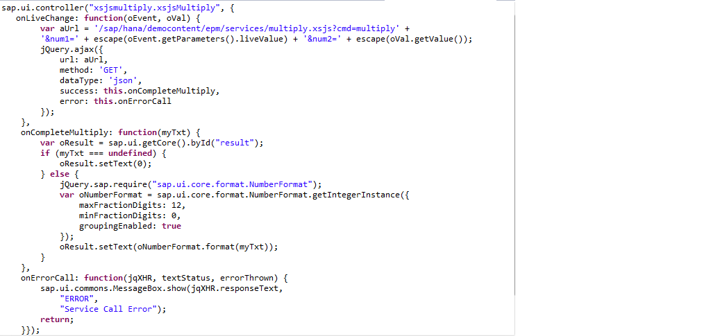
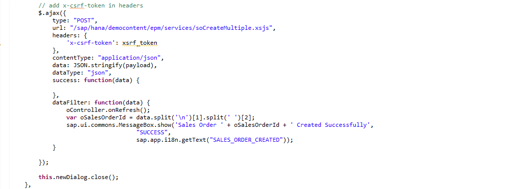

##XSJS Services in SAP HANA

The XSODATA services are simple to understand and easy to consume .They provide a large amount of functionality with minimal amounts of development effort.  However there are a few limitations which come with such a framework approach.  For example in SAP HANA SP5, the OData service is read only.  Support for Insert, Update, and Delete operations are available with SAP HANA SP6.
 
With the SAP HANA Extended Application Services there is also an option for creating server-side JavaScript services where you can not only perform update operations but also have full control over the body format and URL parameter definition. 

In this tutorial, I would like to show you how to create an XSJS service and then consume it from the UI using the <a href="http://help.sap.com/hana/SAP_HANA_Interactive_Education_SHINE_en.pdf" target="_blank">**SHINE**</a> demo model as the reference:

But before I move on with details on XSJS Services , let me first will explain you what is JavaScript. 

JavaScript is an object-oriented computer programming language commonly used to create interactive effects within web browsers.
It provides the following:  

- Client-side JavaScript allows an application to place elements on an HTML form and respond to user events such as mouse clicks, form input, and page navigation.
- Server-side JavaScript allows an application to communicate with a relational database, provide continuity of information from one invocation to another of the application, or perform file manipulations on a server.

Now let me talk about **XSJS Services**.

SAP HANA Extended Application Services (SAP HANA XS) supports server-side application programming in JavaScript. The server-side application you develop uses JavaScript APIs to expose authorized data to client requests, for example, for consumption by a client GUI such as a Web browser, SAPUI5 applications, or mobile clients. 

SAP HANA Extended Application Services also allows development on the server side using JavaScript (via project files with the extension XSJS). Core APIs of SAP HANA Extended Application Services are, therefore, exposed as JavaScript functions; providing easy access to the HTTP Request and Response object as well database access to execute SQL or call SQLScript Procedures.
The power of XSJS services comes from the ability to access the database objects, but also have full control over the body output and to further manipulate the result set after selection.

Some of the salient features of XSJS Services are:

- One language: for Client and Sever
- JavaScript is a widely used language among the developers
- Facilitates Rapid development

The XSJS Application-Programming Interface (API),interact with the SAP HANA XS runtime environment and access SAP HANA database capabilities and directly expose, update, insert, and delete data

#####Simple XSJS Service

In the first example we create a simple xsjs service wherein we take two numbers as URL Request Parameters and multiply them together and then return the results as text in the Response Body. 

  

Next we bind the XSJS Service to the UI Controller  as shown below:

  

The resultant UI accepts the two numbers and returns the result back to the user.

  

However the power of XSJS services comes not only from the ability to access the database objects, but also you have full control over the body output and you can manipulate the result set after selection.

In this example, we use XSJS to create Sales Orders with multiple line items.
This is a more detailed example and gives you an idea of how you have full control on the application logic and can manipulate the code in the XSJS File.

	var overallsoData = JSON.parse(body);
	responseBody += 'BP_ID:' + encodeURI(overallsoData.PARTNERID) + "\n";
	
	//Get the next Sales Order ID from the sequence
	
	pstmt = conn.prepareStatement('SELECT \"SAP_HANA_DEMO\".\"sap.hana.democontent.epm.data::salesOrderId\".NEXTVAL as OverallId from Dummy');
    overAllId = rs.getNString(1);

	so_items = overallsoData.SalesOrderItems; // get all the Item details

	//Insert all Sales Order Items
	
		if (so_items) {
    	for (i; i < so_items.length; i++) {
        responseBody += 'item' + i + ' ' + 'Product_Id:' + so_items[i].Product_Id;
        responseBody += 'item' + i + ' ' + 'Quantity:' + so_items[i].Quantity;

        lv_productid = encodeURI(so_items[i].Product_Id);
        lv_quantity = encodeURI(so_items[i].Quantity);
     
	 // Get price of the product from Product table
	
		pstmt = conn.prepareStatement('SELECT PRICE from "SAP_HANA_DEMO"."sap.hana.democontent.epm.data::EPM.MD.Products" where PRODUCTID = ?');
        pstmt.setString(1, lv_productid);

        if (rs.next()) {
            lv_price = rs.getNString(1);
            responseBody += 'lv_price ' + lv_price + '\n';
        }

    //create local temporary table to pass as input to the Decision Table Procedure for Tax calculation
	
		pstmt = conn.prepareStatement("create local temporary table #TT_IN(PARTNERID nvarchar(10),COMPANYNAME nvarchar(80),PRODUCTID nvarchar(10))");
       
	//Insert values into the local temporary table for bp id,company name and product id for the tax calculation
          
            pstmt = conn.prepareStatement("insert into  #TT_IN values (?,?,?)");
            pstmt.setString(1, lv_bp_id);
            pstmt.setString(2, lv_company);
            pstmt.setString(3, lv_productid);

    //Call the Procedure for Tax Calculation generated by the Decision Table
	
		pc = conn.prepareCall('CALL "_SYS_BIC"."sap.hana.democontent.epm.models/DT_TAX_CALCULATION"(#TT_IN, ?) WITH OVERVIEW');
    
	//Get the temporary output table name    
    
	    rs = pc.getResultSet();
        while (rs.next()) {
            lv_table = rs.getString(2);
        }
    
	//Get the Tax code value from the output table for the Company Name and Product ID
    
	    pstmt = conn.prepareStatement('SELECT TAX from ' + lv_table);
        rs = pstmt.executeQuery();

        if (rs.next()) {
            lv_tax = rs.getFloat(1);
            responseBody += 'lv_tax ' + lv_tax + '\n';
        }
        lv_netamount = lv_price * lv_quantity;
        //Get the tax amount based on the tax code
        lv_taxamount = lv_netamount * lv_tax;
        lv_grossamount = lv_netamount + lv_taxamount;
    //Insert Item into table
    
	   pstmt = conn.prepareStatement('insert into "SAP_HANA_DEMO"."sap.hana.democontent.epm.data::EPM.SO.Item"' + " values(?,?,?,'','EUR',?,?,?,'I','',?,'EA','')"); 
        pstmt.setString(1, '0' + overAllId);
         pstmt.setString(3, lv_productid);
        pstmt.setDouble(4, lv_grossamount);
        pstmt.setDouble(5, lv_netamount) ; ……….
        
        item_id = item_id + 10;

    //Calculate the total of net amount, gross amount and tax amount for all line items
    
	    lv_so_netamount = lv_so_netamount + lv_netamount;
        lv_so_grossamount = lv_so_grossamount + lv_grossamount;
        lv_so_taxamount = lv_so_taxamount + lv_taxamount;

	//Insert Sales Order Header
	
		pstmt = conn.prepareStatement('insert into \"SAP_HANA_DEMO\".\"sap.hana.democontent.epm.data::EPM.SO.Header\"' + " values(?,'0000000033',CURRENT_DATE,'0000000033',CURRENT_DATE,''," + "?,'EUR',?,?,?,'N','I','I')");
		pstmt.setString(1, '0' + overAllId);
		pstmt.setString(2, overallsoData.PARTNERID);
		pstmt.setDouble(3, lv_so_grossamount); …..
		rs = pstmt.execute();
		conn.commit();

In the above code snippet you can see how you can modify the code within the XSJS Service.
The XSJS Service is bound to the Sales Order Worklist UI Controller as shown in the below screenshot:

 

The XSJS Service gets triggered on click on the New button in the Sales Order Worklist UI.  

A new Sales Order gets created with multiple line items using the above service.
 

 

 To view the entire code of the XSJS Service, refer to the <a href="http://help.sap.com/hana/SAP_HANA_Interactive_Education_SHINE_en.pdf" target="_blank">**SHINE**</a> demo model.
 Thus you can see how a developer can benefit by using server side JavaScript based service and manipulate the data as per the application needs.

- For the latest documentation on SHINE refer to: <a href="http://help.sap.com/hana/SAP_HANA_Interactive_Education_SHINE_en.pdf" target="_blank">**SHINE GUIDE**</a>  
- For more information refer to the SAP HANA Developer Guide:<a href="http://help.sap.com/hana/SAP_HANA_Developer_Guide_en.pdf" target="_blank">**SAP HANA DEVELOPER GUIDE**</a>

